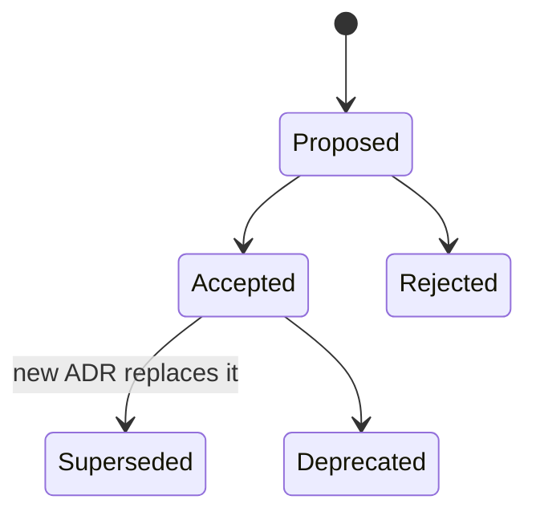

# Architecture Decision Records

These use the Michael Nygard format. An ADR is **immutable once Accepted**: to change a decision, write a new ADR that supersedes it.

| # | Title | Status |
|---|---|---|
| [0000](0000-template.md) | Template | n/a |
| [0001](0001-sqlite.md) | SQLite as the only database | Accepted |
| [0002](0002-no-auth-edge-protection.md) | No in-app auth; protect at the edge | Accepted (edge mechanism: see [0009](0009-tailscale-and-cloudflare-access.md)) |
| [0003](0003-ponytail-minimal-code.md) | Ponytail: minimal code, rigorous process | Accepted |
| [0004](0004-railway-deployment.md) | Local Docker until v1.0.0, then Railway with a volume | Accepted (phone access: see [0009](0009-tailscale-and-cloudflare-access.md)) |
| [0005](0005-monorepo-single-image.md) | npm-workspaces monorepo, single Docker image | Proposed |
| [0006](0006-in-app-playground.md) | In-app `/playground` route instead of Storybook | Accepted |
| [0007](0007-release-please-semver.md) | SemVer + Conventional Commits + release-please | Accepted |
| [0008](0008-contrast-deviation.md) | Keep the design's colour contrast for now (temporary WCAG exception) | Accepted (temporary) |
| [0009](0009-tailscale-and-cloudflare-access.md) | Tailscale for phone access before v1.1, Cloudflare Access on Railway | Accepted |
| [0010](0010-ai-provider-choice-and-spend-cap.md) | AI provider chosen in settings (Claude, Mistral, DeepSeek) with a monthly spend cap | Accepted |
| [0011](0011-nutrition-sources-off-ciqual.md) | Nutrition sources: manual, Open Food Facts, CIQUAL (USDA dropped) | Accepted |

