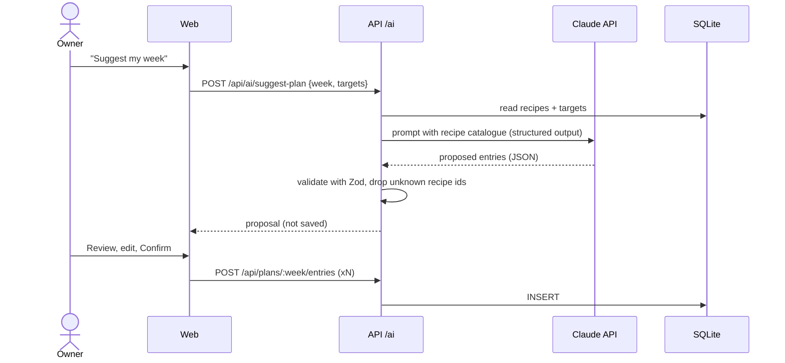

# Backend architecture

Node LTS + Hono + TypeScript, and SQLite through Drizzle.

## 1. Folder structure

```
apps/api/src/
├── index.ts            Boot: validate env, run migrations, start server, serve web build
├── env.ts              Zod-validated env (DATABASE_PATH, PORT, ANTHROPIC_API_KEY?)
├── db/
│   ├── schema.ts       Drizzle tables (source of truth for data-model.md)
│   ├── client.ts       better-sqlite3 + WAL mode + foreign_keys=ON
│   └── migrations/     Generated by drizzle-kit, committed
├── routes/             One file per resource: ingredients, recipes, plans, shopping, nutrition, ai
├── services/           Only where a route needs more than one query (e.g. shopping-list generation)
└── integrations/       openfoodfacts.ts, usda.ts, claude.ts (thin, mocked in tests)
```

Business rules such as nutrition sums, unit conversion and list merging live in `packages/shared` as **pure functions**. That lets them be unit-tested in isolation, and the web app can reuse them for optimistic UI.

## 2. API surface (v1 draft)

All routes are under `/api`. Everything else serves the PWA (`index.html` fallback).

| Method | Path | Purpose | PRD |
|---|---|---|---|
| GET/POST | `/ingredients` | List (search `?q=`), create | R-1 |
| GET/PATCH/DELETE | `/ingredients/:id` | Read, update, delete | R-1 |
| POST | `/ingredients/import` | Import from OFF/USDA by barcode or search result id | N-4 |
| GET/POST | `/recipes` | List (`?q=&tag=`), create | R-2, R-4 |
| GET/PATCH/DELETE | `/recipes/:id` | Includes computed nutrition per serving | R-2, R-3 |
| GET | `/plans/:isoWeek` | Week plan with entries | P-1, P-4 |
| POST | `/plans/:isoWeek/entries` | Add a meal entry | P-2 |
| PATCH/DELETE | `/plans/:isoWeek/entries/:id` | Move, change servings, remove | P-3 |
| POST | `/plans/:isoWeek/copy-from/:otherWeek` | Copy a week | P-3 |
| GET | `/nutrition/:isoWeek` | Daily and weekly totals against targets | N-1, N-2 |
| GET/PUT | `/targets` | Personal targets | N-2 |
| POST | `/shopping-lists/:isoWeek/generate` | Build a list from the plan | S-1 |
| GET/PATCH | `/shopping-lists/:isoWeek` | Items, check off, manual items | S-2, S-3 |
| POST | `/ai/suggest-plan` · `/ai/estimate-ingredient` | Returns a **proposal**; nothing is persisted | A-1…A-3 |
| GET | `/health` | Liveness + DB check (used by Railway) | NFR |

The final contract for each endpoint is defined in its feature spec and in the `packages/shared` Zod schemas.

## 3. Error model

```json
{ "error": { "code": "VALIDATION_FAILED", "message": "Servings must be > 0", "fields": { "servings": "too_small" } } }
```

| HTTP | code | When |
|---|---|---|
| 400 | `VALIDATION_FAILED` | Zod parse error |
| 404 | `NOT_FOUND` | Unknown id or week |
| 409 | `CONFLICT` | Foreign key or unique violation, e.g. deleting an ingredient that a recipe uses |
| 502 | `UPSTREAM_FAILED` | OFF, USDA or Claude failed |
| 500 | `INTERNAL` | Anything else. The stack trace goes to stderr and is never returned |

## 4. AI integration flow (Sprint 5)

The AI only **proposes**. The owner confirms, and only then does a normal write endpoint persist the data (A-3).



The model and prompt design are decided in the Sprint 5 spec. The API key comes from `ANTHROPIC_API_KEY`, and there's a monthly spend cap (PRD Q4).

## 5. Rules

- A write that touches more than one row goes in **one transaction**.
- Keep the foreign keys and constraints in SQLite (`CHECK`, `NOT NULL`, `UNIQUE`). The DB guards the data, not just the app code (Ponytail).
- Migrations run automatically at boot, and they only go forward. Never edit a migration that has already been released.
- There's no ORM "magic": if a Drizzle query gets hard to read, write plain SQL with `sql```.
