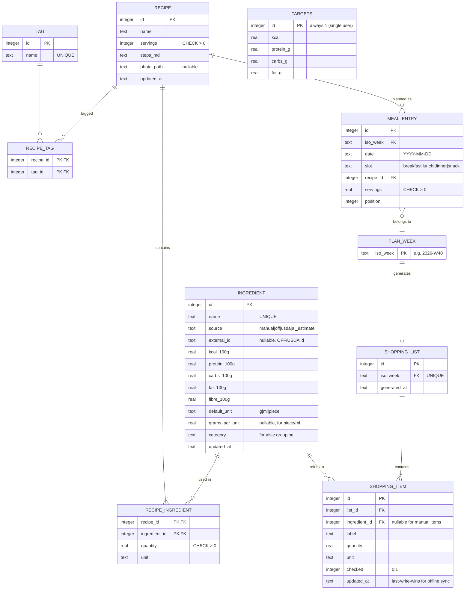

# Data model (SQLite)

This draft covers v1. The source of truth is `apps/api/src/db/schema.ts`, and this document must be updated in the same PR as any schema change.

## 1. Entity-relationship diagram

## 2. Decisions reflected in the schema

| Decision | Reason |
|---|---|
| No `user` table | Single user (ADR-0002) |
| Nutrition is stored per 100 g and computed, never stored per recipe | A single source of truth. The math lives in `packages/shared` |
| `ingredient.source` | Track where the data came from; show a badge on `ai_estimate` values |
| `targets` is a single-row table with `CHECK (id = 1)` | The simplest way to store settings |
| Dates are ISO text | SQLite has no date type; ISO strings sort correctly |
| `ON DELETE RESTRICT` from recipe_ingredient to ingredient | You can't delete an ingredient that a recipe uses (the API returns 409) |
| `ON DELETE CASCADE` from recipe to recipe_ingredient and recipe_tag | Their rows have no meaning without the recipe |

## 3. Migrations

- Migrations only go forward. To roll back, write a new migration.
- CI runs every migration on an empty DB **and** on a fixture DB copied from the previous release, to catch migrations that break existing data.

## 4. Backups and restore

| What | How | Where |
|---|---|---|
| Local | `sqlite3 data/nutrigo.db ".backup data/backups/$(date +%F).db"` via an npm script | Laptop |
| Railway | A daily scheduled job runs `.backup`, then uploads it to object storage. Details in ADR-0004 | Off-platform |
| Restore drill | Once per release from Sprint 4 on: restore the latest backup into a local container and run the smoke e2e | Checklist in `docs/process/release.md` |

Pragmas set at connection: `journal_mode=WAL`, `foreign_keys=ON`, `busy_timeout=5000`.
