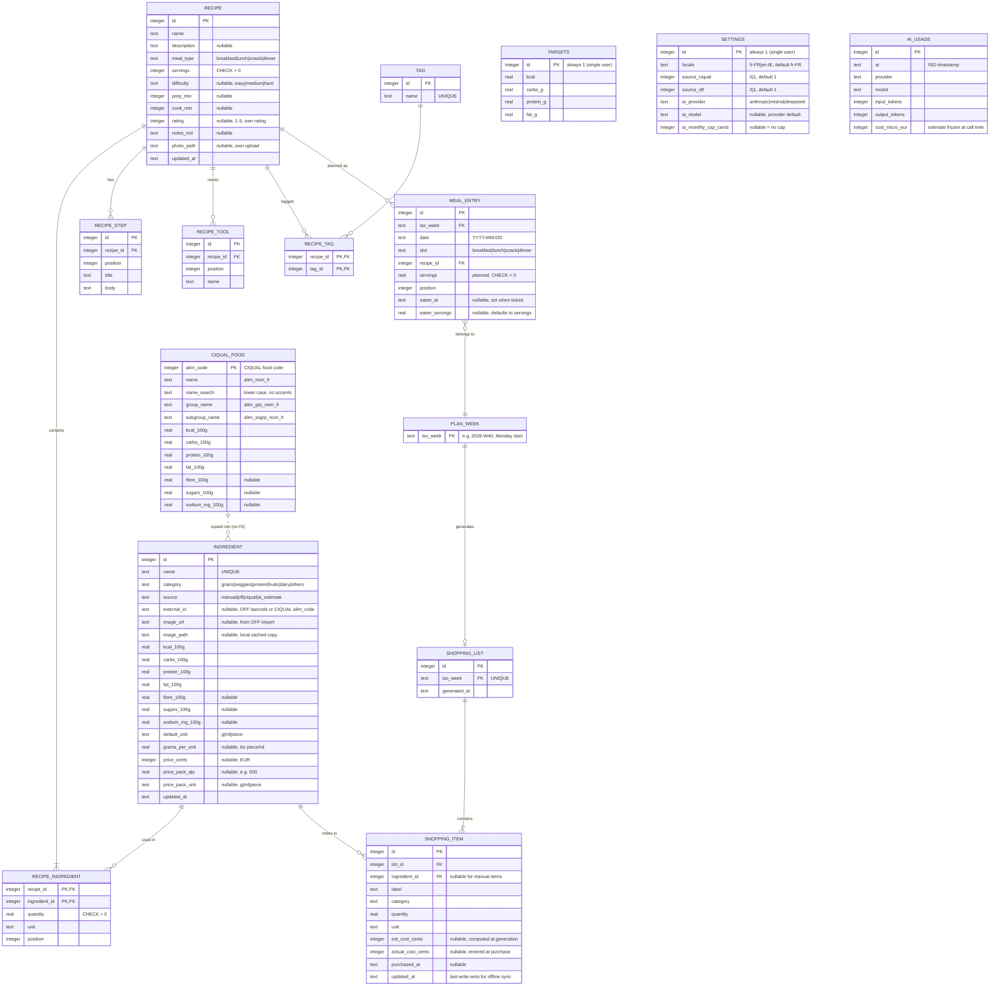

# Data model (SQLite)

This draft covers v1. The source of truth is `apps/api/src/db/schema.ts`, and this document must be updated in the same PR as any schema change.

## 1. Entity-relationship diagram

## 2. Decisions reflected in the schema

| Decision | Reason |
|---|---|
| No `user` table | Single user (ADR-0002) |
| Nutrition is stored per 100 g and computed, never stored per recipe | A single source of truth. The math lives in `packages/shared` |
| The health score is **computed, not stored** | Derived from nutrition per serving (SPEC-002 §7), so it can't drift |
| `ingredient.source` | Track where the data came from; show a badge on `ai_estimate` values |
| `ingredient.image_url` + a cached `image_path` | "Photos from imports" (PRD §5.8); the local copy keeps them offline |
| Money as integer **cents**, EUR only | No floating-point money errors; the single currency is PRD §5.9 |
| The price is stored per pack (`price_cents` / `price_pack_qty`) | Matches how prices appear in stores; estimated cost = quantity ÷ pack × price, rounded up to whole packs (SPEC-005) |
| `meal_entry.eaten_at` / `eaten_servings` | Food diary: planned vs eaten (N-5, N-6) without a separate table |
| `shopping_item.est_cost_cents` is frozen at generation | Later price edits don't rewrite past weeks' estimates |
| Titled steps and tools in their own tables | They are ordered lists (the design shows numbered items); positions let you reorder them |
| `targets` is a single-row table with `CHECK (id = 1)` | The simplest way to store settings |
| `settings` is also a single-row table, stored in the DB rather than in the browser | The laptop and phone share one locale, source switches and AI choice (SPEC-008). API keys are **not** stored here; they stay in env (ADR-0010) |
| `ai_usage.cost_micro_eur` in integer millionths of a euro | One AI call often costs less than a cent. It's still integer money, and the estimate is frozen so price-table updates don't rewrite past months (SPEC-008, owner-approved) |
| `ingredient.source` has `ciqual`, not `usda` | USDA dropped; CIQUAL bundled (ADR-0011) |
| `ciqual_food` is read-only seed data, shipped in a migration | CIQUAL has no API. A local table works offline; a new CIQUAL release is a new migration (SPEC-004 §6) |
| An import copies CIQUAL values into `ingredient`, with no foreign key | CIQUAL updates don't rewrite the owner's ingredients or their edits; `external_id` keeps the `alim_code` |
| `ciqual_food.name_search` is stored lower case without accents | SQLite's `LIKE` ignores case for ASCII only, so "epeautre" must find "Épeautre" |
| Dates are ISO text; weeks are ISO (Monday start) | SQLite has no date type; ISO strings sort correctly |
| `ON DELETE RESTRICT` from recipe_ingredient to ingredient | You can't delete an ingredient that a recipe uses (the API returns 409) |
| `tag` and `recipe_tag` are **not created yet** | S1 decision (SPEC-002 §10): the meal type covers the filters; the tables arrive with a tag filter |
| `ON DELETE CASCADE` from recipe to its ingredients, steps, tools and tags | Their rows have no meaning without the recipe |
| `ON DELETE RESTRICT` from meal_entry to recipe | You can't delete a recipe that's in a plan; archive or remove it from the plan first |

## 3. Migrations

- Migrations only go forward. To roll back, write a new migration.
- CI runs every migration on an empty DB **and** on a fixture DB copied from the previous release, to catch migrations that break existing data.

## 4. Backups and restore

| What | How | Where |
|---|---|---|
| Local (from Sprint 1) | `sqlite3 data/nutrigo.db ".backup data/backups/$(date +%F).db"` via an npm script, daily, keeping 30 | Laptop + copy to a second disk or cloud folder |
| Railway (from v1.1.0) | A daily scheduled job runs `.backup`, then uploads it to object storage. Details in ADR-0004 | Off-platform |
| Restore drill | Once per release from Sprint 1 on: copy the latest backup over the DB, start the built app with Node and run the smoke e2e (no Docker needed) | Checklist in `docs/process/release.md` |

Pragmas set at connection: `journal_mode=WAL`, `foreign_keys=ON`, `busy_timeout=5000`.
