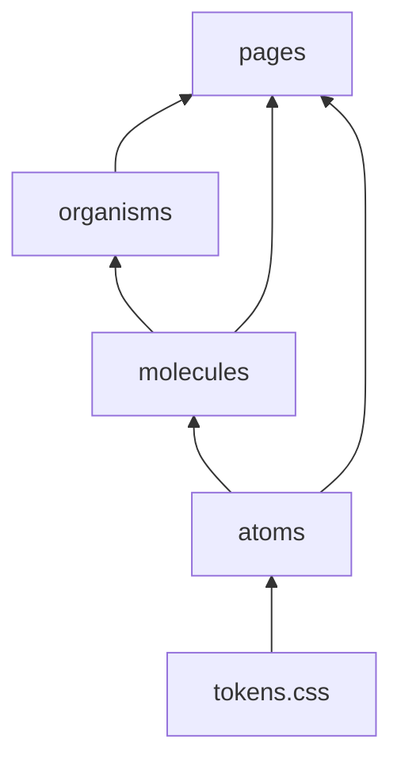
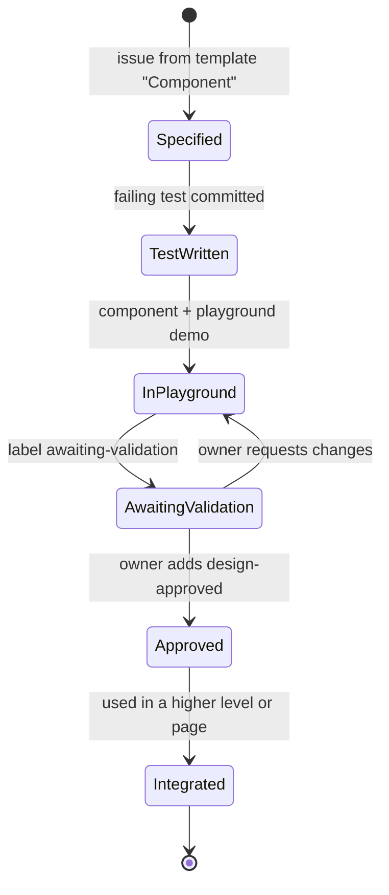

# Frontend architecture

React + TypeScript + Vite, as a mobile-first PWA.

## 1. Folder structure

```
apps/web/src/
├── design-system/
│   ├── tokens.css          CSS custom properties generated from the Claude Design export
│   ├── atoms/              Button, Input, Icon, Tag, NumberField, …
│   ├── molecules/          MacroBadge, IngredientRow, SearchField, …
│   └── organisms/          RecipeCard, DayColumn, MacroChart, ShoppingListGroup, …
├── pages/                  Route-level screens (MealPlanPage, RecipesPage, …)
├── playground/             /playground route: one demo per component (dev + preview builds only)
├── api/                    Typed fetch wrappers built on the shared Zod schemas
├── lib/                    Tiny helpers (no business rules; those live in packages/shared)
└── app.tsx                 Route matching + layout
```

There's no `sw.ts`. `vite-plugin-pwa` generates the manifest and `dist/sw.js` at build time from `vite.config.ts`, and the icons live in `apps/web/public/` (ADR-0012).

Each component lives in its own folder:

```
atoms/Button/
├── Button.tsx
├── Button.test.tsx         written FIRST
├── Button.playground.tsx   every variant and state, registered in /playground
└── index.ts
```

## 2. Atomic levels

Each level may only import from the levels below it. ESLint enforces this with `import/no-restricted-paths`.



| Level | Definition | Example (NutriGo) | May use state/data? |
|---|---|---|---|
| Atom | One HTML element with styling, no domain meaning | `Button`, `Input`, `Chip` | Local UI state only |
| Molecule | A few atoms with one small purpose | `MacroBadge` (label, value, bar), `IngredientRow` | Props only |
| Organism | A self-contained section of a screen, and may know domain types | `RecipeCard`, `DayColumn`, `MacroChart` | Props only; no fetching |
| Page | A route that fetches data and composes organisms | `MealPlanPage` | Yes: data fetching and mutations |

Only **pages** talk to the API. Every other level is pure and driven by props, so each one can be shown in the playground with fake data.

## 3. Component lifecycle

Every component goes through these states, which are tracked by labels on its GitHub issue.



## 4. The /playground route

- URL: `/playground` (index) → `/playground/<level>/<name>`.
- It's on in the dev server and in **preview** builds (`vite build --mode playground`, which reads `apps/web/.env.playground`: `VITE_PLAYGROUND=true`). `npm run build` makes both `dist/` (production) and `dist-playground/` (preview). In production the check is a constant `false`, so the playground chunk isn't even in the bundle, and `/playground` shows "Page not found" (SPEC-001 AC-4).
- Each `*.playground.tsx` exports `{ title, level, states: Record<string, ReactNode> }`, and the index page discovers them with `import.meta.glob`. There's no registry to maintain by hand.
- It shows every state: default, hover/focus, disabled, loading, empty, error, long content, and dark mode if the design system has one.
- Mobile first: the owner reviews on the phone itself (the dev server over Tailscale), so there's no simulated device frame.

## 5. State and data

| Need | Solution | Why |
|---|---|---|
| Server data | Thin `api/` wrappers + React's `use`/Suspense or a small hook. TanStack Query only if caching pain shows up (needs an ADR) | Ponytail: no dependency until there's a real need |
| Forms | Native `<form>` + `FormData` + the shared Zod schema | The platform already does this |
| Global UI state | None at first; React context if needed | YAGNI |
| Routing | History API + a tiny path matcher in the app (ADR-0012) | 5 routes don't need a router; add React Router with a new ADR if loaders are needed |
| Offline | Service worker cache + IndexedDB queue for shopping-list writes | Spec in Sprint 4 |

## 6. Navigation

| Width | Navigation | Source |
|---|---|---|
| < 1200 px | Bottom tab bar, 5 items: **Today** (`/`) · **Recipes** (`/recipes`) · **Plan** (`/plan/:week`) · **Groceries** (`/groceries/:week`) · **Targets** (`/targets`) | Dashboard Mobile (items adapted to scope; approved, PRD Q7) |
| ≥ 1200 px | 252 px sidebar with the same 5 destinations; ≥ 1440 px adds a 340 px aside where the design has one | Dashboard, Meal Plan |

## 7. Styling

- The only source of design values is the CSS custom properties in `tokens.css`, generated from the design system.
- Components use CSS Modules. There's no CSS-in-JS runtime.
- Mobile-first media queries, with touch targets of at least 44 px.
- Charts follow `docs/design-system/dataviz.html`.

## 8. Quality gates specific to the frontend

- Every component has a `*.test.tsx` that covers behaviour and states (Testing Library). Every state is checked with axe (`color-contrast` temporarily off, ADR-0008).
- Every playground page has a Playwright screenshot test, and approved screenshots are committed.
- Lighthouse CI budgets: Performance ≥ 90, Accessibility ≥ 90 (100 once ADR-0008 is resolved), Best Practices ≥ 95, PWA installable.
