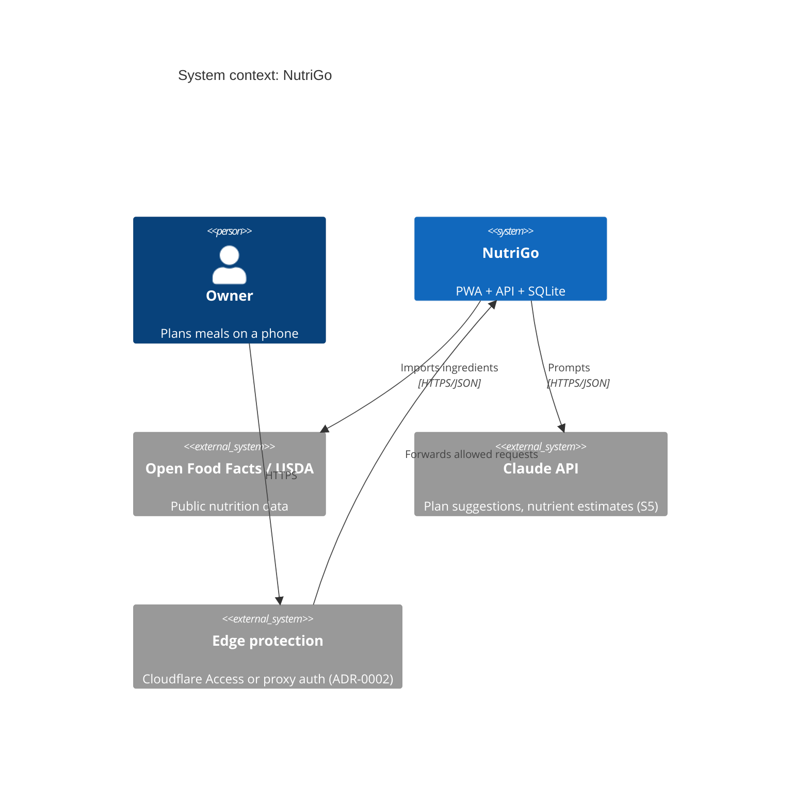
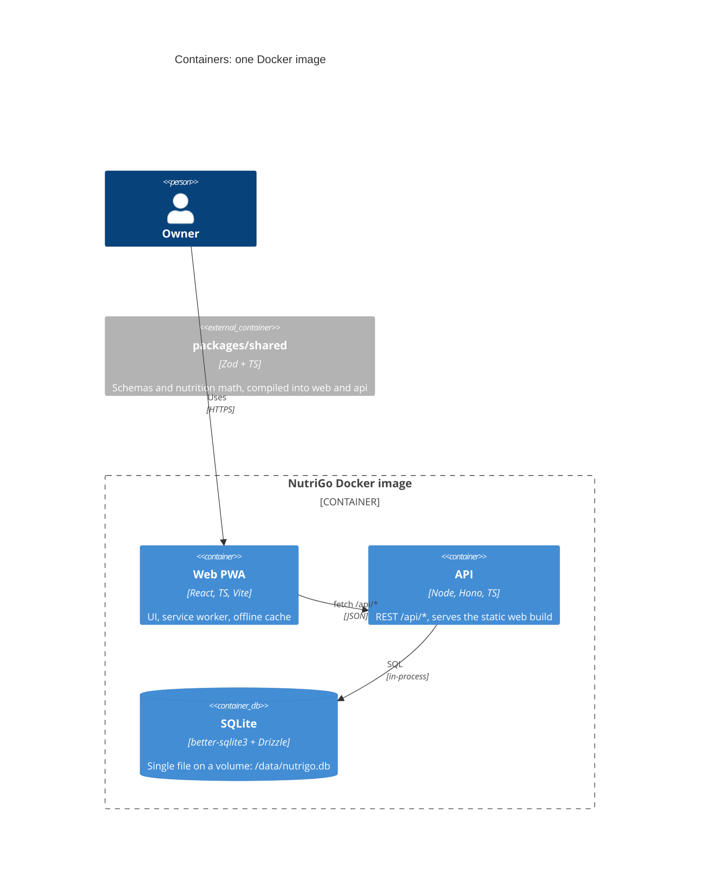
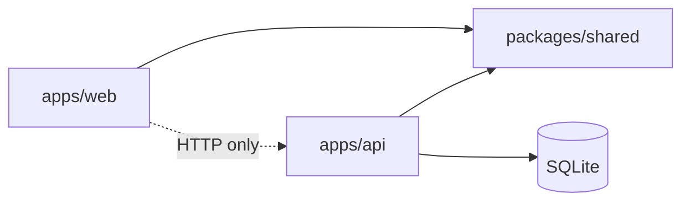
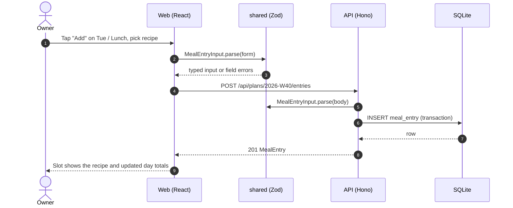
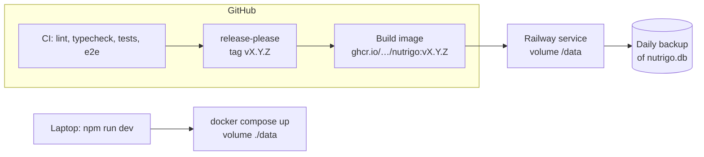

# Architecture overview

| | |
|---|---|
| Status | Proposed (Sprint 0) |
| Decisions | [ADR index](adr/) |

## 1. System context

NutriGo is a single deployable used by one person. The only outbound dependencies are nutrition databases and, from Sprint 5, the Claude API.

## 2. Containers

A single Node process serves both the built PWA (static files) and the JSON API. This means one Railway service, one volume and no CORS (ADR-0005).

## 3. Code-level dependency rule

Dependencies point one way only. `shared` imports nothing from the apps, and the web app never touches the DB.

## 4. A typical request

This is the path of "add a recipe to Tuesday lunch". Validation happens on both sides with the **same** Zod schema.

## 5. Deployment

The app runs locally up to v1.0.0 (Sprints 0–5), then on Railway from v1.1.0 (Sprint 6). The flow is the same in both places: build one image and mount one data directory.

## 6. Cross-cutting concerns

| Concern | Approach |
|---|---|
| Auth | None in the app; protection at the edge (ADR-0002) |
| Logging | No logging library. The API writes unexpected errors to stderr, which Railway captures. There is no request logging (CLAUDE.md rule 8) |
| Errors | The API returns `{ error: { code, message, fields? } }` with the right HTTP status; the web app maps codes to UI states |
| Config | Env vars only: `DATABASE_PATH`, `PORT`, `ANTHROPIC_API_KEY` (S5). They're validated with Zod at boot |
| Offline | The service worker caches the app shell, recipes and the current shopping list (details in the Sprint 4 spec) |
| Time | ISO weeks (`2026-W40`), dates stored as `YYYY-MM-DD` text, Europe/Paris shown in the UI |
| i18n | UI copy in English for v1, with strings kept in one module so they can be translated later |

## 7. Related documents

- [frontend.md](frontend.md) · [backend.md](backend.md) · [data-model.md](data-model.md)
- ADRs: [0001 SQLite](adr/0001-sqlite.md) · [0002 No auth](adr/0002-no-auth-edge-protection.md) · [0003 Ponytail](adr/0003-ponytail-minimal-code.md) · [0004 Railway](adr/0004-railway-deployment.md) · [0005 Monorepo, single image](adr/0005-monorepo-single-image.md) · [0006 Playground route](adr/0006-in-app-playground.md) · [0007 Versioning](adr/0007-release-please-semver.md)
