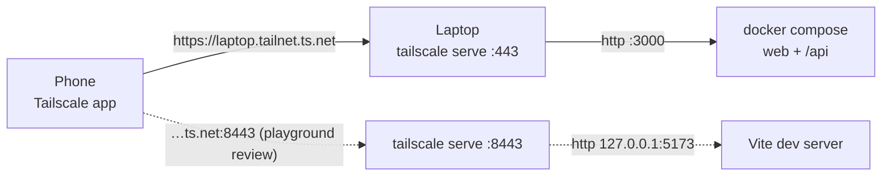

# Phone access over Tailscale

How to open and install the local NutriGo on your phone before v1.1.0 (ADR-0009). Tailscale joins the laptop and the phone in a private network (your *tailnet*), and `tailscale serve` publishes the app there over HTTPS. Nothing is public. HTTPS is required: a PWA only installs and runs its service worker over HTTPS, so `http://192.168.x.x:3000` won't do.

The phone reaches the laptop through the tailnet. `tailscale serve` terminates HTTPS and forwards to the local port:



Commands are for PowerShell on the Windows laptop. Needs Tailscale client 1.52 or later (the `serve` syntax changed in 1.52).

## 1. One-time setup

### Laptop (Windows)

1. Download the installer from https://tailscale.com/download/windows and run it.
2. Click the Tailscale icon in the system tray → **Log in**. A browser opens. Sign in with the account you'll also use on the phone (for example Google).
3. Open a **new** PowerShell and check it's connected:

   ```powershell
   tailscale status
   ```

   The first line is the laptop, with its tailnet IP (`100.x.y.z`) and machine name.

### Tailnet (admin console, in the browser)

4. Go to https://console.tailscale.com/admin/dns.
5. **MagicDNS**: it must say enabled (it's on by default for tailnets created since October 2022). If not, click **Enable MagicDNS**.
6. Note the **Tailnet name** on the same page (like `tail1234.ts.net`). Your URL will be `https://<laptop>.<tailnet name>`.
7. Under **HTTPS Certificates**, click **Enable HTTPS** and confirm the warning.
   - The warning is real: the certificate puts `<laptop>.<tailnet name>` in public Certificate Transparency logs. If the laptop's name is personal (e.g. your full name), rename it first: https://console.tailscale.com/admin/machines → **⋯** on the laptop → **Edit machine name**.

### Phone (Android or iPhone)

8. Install **Tailscale** from the Play Store or the App Store.
9. Open it → **Get started** / **Log in**, and sign in with the **same account** as the laptop.
10. Accept the VPN configuration prompt. The app should show **Connected** and list the laptop.
11. Back on the laptop, `tailscale status` now lists the phone too.

## 2. Serve the app (every time)

This serves the local prod-like container: web and `/api` on one address, port `3000` from `docker-compose.yml`.

1. Start the app, if it isn't running:

   ```powershell
   docker compose up --build -d
   ```

   Check http://localhost:3000 opens on the laptop.
2. Publish it on the tailnet:

   ```powershell
   tailscale serve --bg 3000
   ```

   The first time, the CLI may print a link to enable Serve on your tailnet. Open it, approve, and run the command again. On success it prints the URL and the line to turn it off:

   ```text
   Available within your tailnet:
   https://<laptop>.<tailnet>.ts.net/
   |-- / proxy http://127.0.0.1:3000
   ```

3. On the phone, with Tailscale **Connected**, open `https://<laptop>.<tailnet>.ts.net` in Chrome (Android) or Safari (iPhone).

`--bg` keeps serving in the background, **across reboots**, until you turn it off. Check what's served with:

```powershell
tailscale serve status
```

### Stop serving

```powershell
tailscale serve reset
```

This removes everything `tailscale serve` publishes. To remove only one entry, run the "To disable the proxy, run: …" line that `tailscale serve --bg` printed. `docker compose down` stops the app but leaves the serve entry, which then answers `502`.

## 3. Install the PWA

Works once the PWA shell (#32) is merged; before that there's no manifest, so the browser only offers a plain bookmark. Open the tailnet URL first (section 2), then:

- **Android (Chrome)**: **⋮** menu → **Add to Home screen** → **Install**.
- **iPhone (Safari)**: **Share** button → **Add to Home Screen** → **Add**.

The home screen should show the NutriGo name and icon (SPEC-001 AC-8).

From v1.1.0 the app moves to the Cloudflare domain (ADR-0009). That's a different origin, so you'll install it once more from there.

## 4. Review the playground on the phone

The compose build has the playground off. To review `/playground`, serve the Vite dev server (port `5173`) on a second HTTPS port instead:

1. Start only the web dev server, bound to IPv4, with the tailnet allowed as a host:

   ```powershell
   $env:__VITE_ADDITIONAL_SERVER_ALLOWED_HOSTS = ".ts.net"
   npm run dev -w @nutrigo/web -- --host 127.0.0.1
   ```

   Both settings are needed: by default Vite listens on `[::1]` only on Windows (so Tailscale gets `502`), and rejects any host other than `localhost` (`403 Blocked request`).
2. In a second PowerShell:

   ```powershell
   tailscale serve --bg --https=8443 127.0.0.1:5173
   ```

3. On the phone, open `https://<laptop>.<tailnet>.ts.net:8443/playground`.
4. When you're done: `Ctrl+C` in the dev server terminal, then:

   ```powershell
   tailscale serve --https=8443 off
   ```

The playground doesn't need the API. If you want the full dev app, run `npm run dev -w @nutrigo/api` in a third terminal, after `docker compose down` (both use port `3000`).

## 5. Troubleshooting

| Symptom | Fix |
|---|---|
| Phone: "site can't be reached" | The phone's Tailscale app is off or the laptop is asleep. Check both show in `tailscale status` on the laptop. |
| `tailscale` isn't recognized | Open a new PowerShell after installing, or call `& "C:\Program Files\Tailscale\tailscale.exe" status`. |
| Certificate error, or serve asks to enable HTTPS | HTTPS Certificates aren't on (setup step 7). The first request after enabling can take a few seconds; reload. |
| `502 Bad Gateway` | Nothing is listening on the served port. `docker compose ps` for 3000; for 5173, the dev server must run with `--host 127.0.0.1`. |
| `403 Blocked request. This host is not allowed` | The Vite dev server was started without `__VITE_ADDITIONAL_SERVER_ALLOWED_HOSTS=.ts.net` (section 4, step 1). |
| `npm run dev` fails with port `3000` in use | The container holds it. `docker compose down` first. |
| No "Install" / "Add to Home screen" gives a plain bookmark | The PWA shell (#32) isn't merged yet, or the page isn't the `https://…ts.net` URL. |
