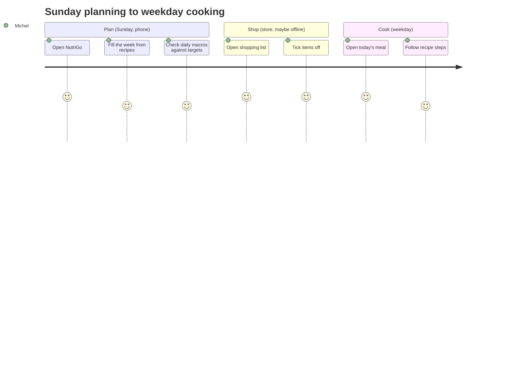

# NutriGo: Product Requirements Document

| | |
|---|---|
| Status | **Draft**: pending the design-system review |
| Owner | Michel Tsarasoa |
| Last updated | 2026-09-23 |
| Target | v1.0.0 at the end of Sprint 5 |

| Revision | Date | Change |
|---|---|---|
| 0.1 | 2026-09-23 | First draft from the kickoff Q&A |

## 1. Problem

Planning healthy meals for the week currently means juggling recipes, nutrition apps and a notes app for groceries. Nothing ties "what I'll eat" to "what that means nutritionally" and "what I need to buy".

## 2. Vision

> One place on my phone where I plan the week's meals and immediately see their nutrition and the shopping list they produce.

## 3. User

A single user: the owner. There are no accounts, no sharing and no multi-tenancy (ADR-0002).

| Persona | Context | Needs |
|---|---|---|
| Michel, owner | Plans on Sunday, checks in the kitchen and at the store, on a phone | Fast entry, readable at a glance, works offline in the store |

## 4. Goals and success measures

| # | Goal | Measure | Target |
|---|---|---|---|
| G1 | Plan a full week quickly | Time to fill 7 days × 3 meals from existing recipes | < 10 min |
| G2 | Know the nutrition of the plan | Daily kcal and macros visible without extra taps | 1 tap from home |
| G3 | Never forget groceries | Shopping list generated from the plan, usable offline | 100 % of plan ingredients |
| G4 | Engineering quality | CI green on `main`, coverage | ≥ 80 % lines on `shared` and `api`, 100 % of components have tests |

### Non-goals (v1)

- Multiple users, auth, sharing, social features
- Native iOS/Android apps (PWA only)
- Medical or diet-prescription advice
- Barcode scanning (a candidate for after v1)

## 5. Scope and requirements

Priority uses **MoSCoW**. IDs are referenced from specs, issues and tests.

### 5.1 Recipes and ingredients (Sprint 1)

| ID | Requirement | Priority |
|---|---|---|
| R-1 | Create, edit and delete ingredients with nutrition per 100 g (kcal, protein, carbs, fat, fibre) | Must |
| R-2 | Create, edit and delete recipes: name, servings, ingredients with quantities, steps, tags | Must |
| R-3 | Nutrition per serving is computed from the ingredients | Must |
| R-4 | Search and filter recipes by name and tag | Should |
| R-5 | Recipe photo | Could |

### 5.2 Weekly meal plan (Sprint 2): the "Meal Plan" screen in Claude Design

| ID | Requirement | Priority |
|---|---|---|
| P-1 | Week view (Mon–Sun), each day with slots: breakfast, lunch, dinner, snack | Must |
| P-2 | Assign a recipe (with a number of servings) to a slot | Must |
| P-3 | Move, duplicate and clear a meal, and copy the previous week | Should |
| P-4 | Navigate between weeks | Must |

### 5.3 Nutrition tracking (Sprint 3)

| ID | Requirement | Priority |
|---|---|---|
| N-1 | Daily and weekly totals of kcal and macros from the plan | Must |
| N-2 | Personal targets (kcal and macros) with progress against them | Must |
| N-3 | Charts: daily macros and a weekly trend (following the dataviz rules) | Must |
| N-4 | Import ingredient data from Open Food Facts / USDA, cached locally | Should |

### 5.4 Shopping list (Sprint 4)

| ID | Requirement | Priority |
|---|---|---|
| S-1 | Generate a list from a week's plan, with quantities merged per ingredient | Must |
| S-2 | Check items off, and add manual items | Must |
| S-3 | Works offline (PWA); changes sync when back online | Must |
| S-4 | Group items by store aisle or category | Should |

### 5.5 Claude-assisted features (Sprint 5)

| ID | Requirement | Priority |
|---|---|---|
| A-1 | Suggest a week's plan from targets and existing recipes | Should |
| A-2 | Estimate the nutrition of an ingredient that isn't in any database | Should |
| A-3 | The AI never writes data without explicit confirmation | Must |

### 5.6 Nutrition data sources

All three sources are used, in this priority order: **manual entry** (always available) → **Open Food Facts / USDA** (import and cache) → **Claude estimate** (fallback, flagged as estimated). Every ingredient stores its `source`.

## 6. Non-functional requirements

| Area | Requirement |
|---|---|
| Platform | Mobile-first PWA, installable, usable offline for reads and the shopping list |
| Performance | Lighthouse Performance ≥ 90 on mobile; interactive in < 2 s on 4G |
| Accessibility | WCAG 2.2 AA; axe checks pass in CI |
| Privacy | Data stays in the owner's SQLite; only AI prompts go out to the Claude API |
| Security | No auth in the app. The Railway URL is protected at the edge (ADR-0002); secrets live only in env |
| Reliability | Daily SQLite backup, and a tested restore procedure |
| Maintainability | Ponytail-minimal code; all changes tested; ADR for each new dependency |

## 7. User journey (target)

The journey below shows where friction is expected. A low score means pain today.

## 8. Release plan

See [`../roadmap.md`](../roadmap.md). There is one release per two-week sprint, v0.1.0 → v1.0.0.

## 9. Risks and open questions

| # | Item | Type | Next step |
|---|---|---|---|
| Q1 | The design-system page in Claude Design isn't in the repo yet | Open | Export it to `design/source/` |
| Q2 | How is the Railway URL protected: Cloudflare Access, basic auth at a proxy, or an unguessable URL? | Open | Decide before Sprint 4 (ADR-0002) |
| Q3 | Open Food Facts vs USDA: which is primary for French products? | Open | Spike in Sprint 3 |
| Q4 | Monthly budget for the Claude API | Open | Set before Sprint 5 |
| R1 | SQLite on Railway loses data without a volume | Risk | Volume and backups (ADR-0004) |
| R2 | Offline sync conflicts on the shopping list | Risk | Last-write-wins per item, spec in Sprint 4 |
