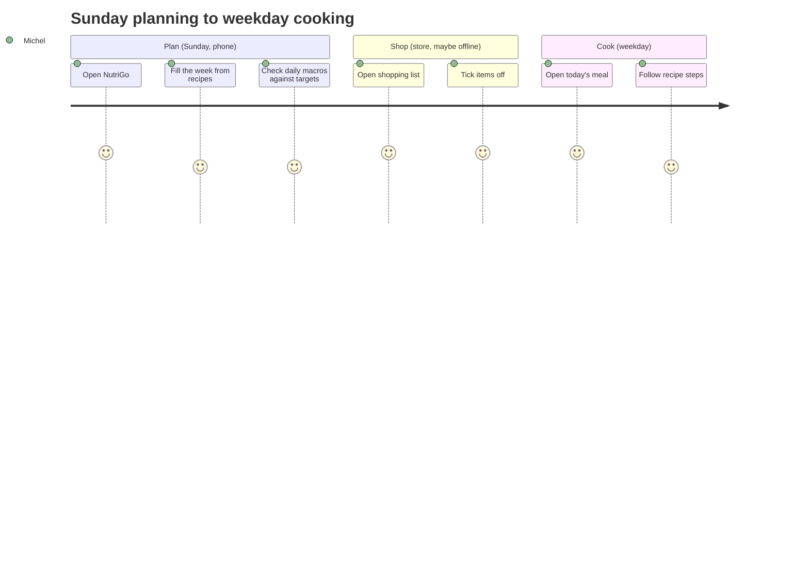

# NutriGo: Product Requirements Document

| | |
|---|---|
| Status | **Draft**: design reviewed (rev 0.3), awaiting owner approval |
| Owner | Michel Tsarasoa |
| Last updated | 2026-09-23 |
| Target | v1.0.0 (local) at the end of Sprint 5 · v1.1.0 on Railway at the end of Sprint 6 |

| Revision | Date | Change |
|---|---|---|
| 0.1 | 2026-09-23 | First draft from the kickoff Q&A |
| 0.2 | 2026-09-23 | Railway deployment moved after v1.0.0 (new §5.6, Sprint 6) |
| 0.3 | 2026-09-23 | Claude Design export reviewed: recipe fields, food diary (check-off), grocery costs in EUR, photos from imports, Monday weeks; progress/activity/insights out of scope |
| 0.4 | 2026-09-23 | Open questions Q1–Q9 answered: Tailscale then Cloudflare Access (ADR-0009), AI provider choice + spend cap (ADR-0010), CIQUAL replaces USDA (ADR-0011), new Settings (§5.10, SPEC-008) |

## 1. Problem

Planning healthy meals for the week currently means juggling recipes, nutrition apps and a notes app for groceries. Nothing ties "what I'll eat" to "what that means nutritionally" and "what I need to buy".

## 2. Vision

> One place on my phone where I plan the week's meals and immediately see their nutrition and the shopping list they produce.

## 3. User

A single user: the owner. There are no accounts, no sharing and no multi-tenancy (ADR-0002).

| Persona | Context | Needs |
|---|---|---|
| Michel, owner | Plans on Sunday, checks in the kitchen and at the store, on a phone | Fast entry, readable at a glance, works offline in the store |

## 4. Goals and success measures

| # | Goal | Measure | Target |
|---|---|---|---|
| G1 | Plan a full week quickly | Time to fill 7 days × 3 meals from existing recipes | < 10 min |
| G2 | Know the nutrition of the plan | Daily kcal and macros visible without extra taps | 1 tap from home |
| G3 | Never forget groceries | Shopping list generated from the plan, usable offline | 100 % of plan ingredients |
| G4 | Engineering quality | CI green on `main`, coverage | ≥ 80 % lines on `shared` and `api`, 100 % of components have tests |

### Non-goals (v1)

- Multiple users, auth, sharing, social features
- Native iOS/Android apps (PWA only)
- Medical or diet-prescription advice
- Barcode scanning (a candidate for after v1)
- From the design, **out of scope**: body/weight progress (Progress screen), steps, sleep, water, workouts, exercises and burned calories, Health Insights articles, messages, reviews and social features, promo banner, logout and user profile

## 5. Scope and requirements

Priority uses **MoSCoW**. IDs are referenced from specs, issues and tests.

### 5.1 Recipes and ingredients (Sprint 1)

| ID | Requirement | Priority |
|---|---|---|
| R-1 | Create, edit and delete ingredients with nutrition per 100 g (kcal, protein, carbs, fat, fibre) | Must |
| R-2 | Create, edit and delete recipes: name, description, meal type (breakfast/lunch/snack/dinner), servings, ingredients with quantities, titled steps, tools, notes, tags | Must |
| R-3 | Nutrition per serving is computed from the ingredients | Must |
| R-4 | Search and filter recipes by name and tag | Should |
| R-5 | Recipe photo, from imports (see §5.8) | Could |
| R-6 | Difficulty (easy/medium/hard), prep time and cook time | Should |
| R-7 | Your own rating (1–5); no reviews, no rating counts | Could |
| R-8 | Health score (0–10) computed from nutrition per serving; the formula is defined in SPEC-002 and shown as a number | Should |
| R-9 | Scale the ingredient quantities with a servings stepper on the recipe page | Should |

### 5.2 Weekly meal plan (Sprint 2): the "Meal Plan" screen in Claude Design

| ID | Requirement | Priority |
|---|---|---|
| P-1 | Week view (Mon–Sun, ISO weeks), each day with slots in the order breakfast, lunch, snack, dinner. On mobile: a week strip plus a one-day view | Must |
| P-2 | Assign a recipe (with a number of servings) to a slot | Must |
| P-3 | Move, duplicate and clear a meal, and copy the previous week | Should |
| P-4 | Navigate between weeks | Must |

### 5.3 Nutrition tracking (Sprint 3)

| ID | Requirement | Priority |
|---|---|---|
| N-1 | Daily and weekly totals of kcal and macros from the plan | Must |
| N-2 | Personal targets (kcal and macros) with progress against them | Must |
| N-3 | Charts: daily macros and a weekly trend (following the dataviz rules) | Must |
| N-4 | Import ingredient data from Open Food Facts (live, cached locally) and CIQUAL (French generic foods, bundled) | Should |
| N-5 | **Food diary**: tick a planned meal as eaten, optionally adjusting the servings eaten; untick to undo | Must |
| N-6 | Show **planned vs eaten**: kcal and macros eaten (ticked meals only), planned for the day, and left vs target | Must |

### 5.4 Shopping list (Sprint 4)

| ID | Requirement | Priority |
|---|---|---|
| S-1 | Generate a list from a week's plan, with quantities merged per ingredient | Must |
| S-2 | Check items off, and add manual items | Must |
| S-3 | Works offline (PWA); changes sync when back online | Must |
| S-4 | Group items by store aisle or category | Should |
| S-5 | Each ingredient can store a price in EUR per pack (price + pack size); the list shows an estimated cost per item and in total | Should |
| S-6 | When ticking an item as purchased, you can enter the actual price paid | Should |
| S-7 | Spending insights: estimated vs actual per week, and a breakdown by category | Could |

### 5.5 AI-assisted features (Sprint 5)

| ID | Requirement | Priority |
|---|---|---|
| A-1 | Suggest a week's plan from targets and existing recipes | Should |
| A-2 | Estimate the nutrition of an ingredient that isn't in any database | Should |
| A-3 | The AI never writes data without explicit confirmation | Must |
| A-4 | The AI provider is chosen in Settings: Claude (default), Mistral or DeepSeek (ADR-0010) | Should |
| A-5 | A monthly AI spend cap in EUR, set in Settings; calls are refused once it's reached (ADR-0010) | Should |

### 5.6 Production deployment (Sprint 6, after v1.0.0)

Until v1.0.0 the app runs only locally (Docker Compose).

| ID | Requirement | Priority |
|---|---|---|
| D-1 | Deploy to Railway from a release tag, with SQLite on a Railway volume | Must |
| D-2 | Protect the public URL at the edge (ADR-0002) | Must |
| D-3 | Daily off-site backup of the production DB, keeping 30 days | Must |
| D-4 | Move the local data to production once (a one-off import of the local `nutrigo.db`) | Must |

### 5.7 Nutrition data sources

The sources are **manual entry** (always available), **CIQUAL** (the ANSES French generic food table, bundled in the DB, works offline), **Open Food Facts** (branded products, live search, cached) and, last, an **AI estimate** (fallback, flagged as estimated). USDA isn't used. The search order of CIQUAL and Open Food Facts, and whether each is on, is a setting (default: CIQUAL → Open Food Facts). Every ingredient stores its `source` (ADR-0011).

### 5.8 Photos

Your **own uploaded photo** is the main source for a recipe. An ingredient imported from Open Food Facts keeps the product image URL, cached locally for offline use. A recipe shows its own photo when you upload one, otherwise a mosaic of its ingredients' imported images, otherwise a token-coloured placeholder by meal type. The AI providers don't generate images, so AI-suggested recipes have no photo of their own.

### 5.9 Conventions

Weeks start on **Monday** (ISO 8601, `2026-W40`). Currency is **EUR**. Units are g, ml and pieces, always written `g` (never `gr`). Numbers and money are formatted with the locale from Settings, **`fr-FR` by default** (1 240 kcal, 57,40 €); `en-IE` is the alternative (1,240 kcal, €57.40).

### 5.10 Settings (SPEC-008)

One configuration screen for app-wide preferences. It's stored in the DB, so it follows the app rather than the device.

| ID | Requirement | Priority |
|---|---|---|
| C-1 | Number and currency locale: `fr-FR` (default) or `en-IE` | Must |
| C-2 | Nutrition sources: the search order of CIQUAL and Open Food Facts, and turning each one on or off | Should |
| C-3 | AI provider and model (A-4); a provider with no API key in env can't be selected | Should |
| C-4 | Monthly AI spend cap in EUR (A-5), with the current month's estimated spend shown | Should |

## 6. Non-functional requirements

| Area | Requirement |
|---|---|
| Platform | Mobile-first PWA, installable, usable offline for reads and the shopping list |
| Performance | Lighthouse Performance ≥ 90 on mobile; interactive in < 2 s on 4G |
| Accessibility | WCAG 2.2 AA; axe checks pass in CI. **Temporary exception:** the brand colour contrast failures are kept until the owner updates the token values (ADR-0008) |
| Privacy | Data stays in the owner's SQLite; only AI prompts go out, to the provider chosen in Settings. Mistral is hosted in the EU; **DeepSeek is hosted in China**, and the Settings screen says so (ADR-0010) |
| Security | No auth in the app. Up to v1.0 it runs locally and the phone reaches it over Tailscale; from v1.1 the Railway URL is behind Cloudflare Access (ADR-0002, ADR-0009). Secrets, including the AI API keys, live only in env |
| Reliability | Daily SQLite backup (local from Sprint 1, off-site from v1.1), and a tested restore procedure |
| Maintainability | Ponytail-minimal code; all changes tested; ADR for each new dependency |

## 7. User journey (target)

The journey below shows where friction is expected. A low score means pain today.

## 8. Release plan

See [`../roadmap.md`](../roadmap.md). There is one release per two-week sprint, v0.1.0 → v1.0.0.

## 9. Risks and open questions

| # | Item | Type | Next step |
|---|---|---|---|
| Q1 | The design-system page in Claude Design isn't in the repo yet | Resolved | Exported: `design/source/Design System.dc.html` |
| Q2 | How is the Railway URL protected: Cloudflare Access, basic auth at a proxy, or an unguessable URL? | Decided | **Cloudflare Access** (ADR-0009) |
| Q3 | Open Food Facts vs USDA: which is primary for French products? | Decided | **Manual + Open Food Facts + CIQUAL**, order set in Settings; USDA dropped; the spike is cancelled (ADR-0011) |
| Q4 | Monthly budget for the Claude API | Decided | **Choice of provider** (Claude, Mistral, DeepSeek) and a **monthly € cap set in Settings** (ADR-0010). The cap amount is the owner's to set in the app |
| Q6 | Recipe photos: is "upload your own photo" acceptable as the main source, since imports only give ingredient product images? | Decided | **Yes**, own uploads are the main source; the mosaic and placeholder fallbacks are kept (§5.8) |
| Q7 | The mobile tab bar is proposed as Today · Recipes · Plan · Groceries · Targets. OK? | Decided | **Yes**, as proposed |
| Q8 | Health-score formula (SPEC-002 §7 proposal) | Decided | **Approved** as written in SPEC-002 §7 |
| Q9 | Number and currency locale: `fr-FR` (1 240 kcal, 57,40 €) or `en-IE` (1,240 kcal, €57.40)? | Decided | **A setting**, `fr-FR` by default (§5.9, §5.10, SPEC-008) |
| Q5 | How does the phone reach the local app before v1.1? A service worker (offline, install) needs HTTPS, and plain `http://192.168.x.x` won't allow it | Decided | **Tailscale** (`tailscale serve`) on the laptop and phone (ADR-0009) |
| R1 | Before v1.1 all data lives on one laptop | Risk | Local daily backup from Sprint 1 (ADR-0004) |
| R3 | SQLite on Railway loses data without a volume | Risk | Volume and backups in Sprint 6 (ADR-0004) |
| R2 | Offline sync conflicts on the shopping list | Risk | Last-write-wins per item, spec in Sprint 4 |
