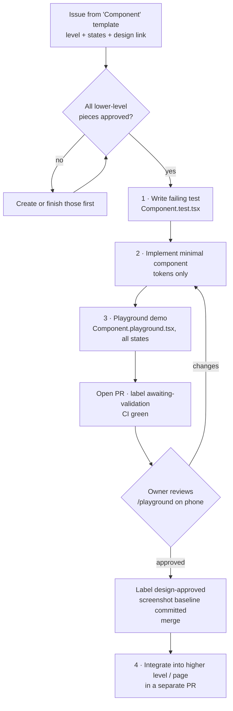

# Coding policy

This is how code gets written in NutriGo. It applies to people and agents alike. `CLAUDE.md` holds the short version.

## 1. Principles

1. **Minimal code (Ponytail, ADR-0003).** Before writing anything, climb the ladder: does it need to exist → does it already exist here → stdlib → platform feature → installed dependency → new code.
2. **Test first.** A behaviour doesn't exist until a test describes it.
3. **Bottom-up UI.** Atoms → molecules → organisms → pages. No level is built before the pieces below it are approved.
4. **Validate before integrating.** The owner approves every component in `/playground` before it's used anywhere.
5. **Refactor continuously, in separate commits.** Every PR leaves the code at least as clean as it found it, but refactors never share a commit with behaviour changes.

## 2. The component workflow (mandatory for all UI)

Rules:
- **Order is enforced per sprint**: the Sprint 0 atoms first, then the molecules each feature sprint needs, then its organisms, then the page.
- The component PR contains **no page integration**. Integration is its own PR, which references the approved component.
- A component's PR must show **every state** in the playground: default, focus, disabled, loading, empty, error, overflow/long text, and small (320 px) and large widths.
- Only design tokens are allowed: no hex colours, pixel sizes or font names in component CSS. Stylelint enforces this.
- Components below page level don't fetch data and don't import from `api/`.

## 3. Test-first ("bricks of tests")

For **every** change:

| You change… | You first write… |
|---|---|
| A pure function in `shared` | A Vitest unit test covering normal cases, edge cases (0, negative, empty, unit conversions) and a regression case for each bug |
| An API route | An integration test: Hono `app.request()` against a temp SQLite DB, covering the happy path and every error code the route can return |
| A component | A Testing Library test of behaviour and states, plus an axe check |
| A page / user flow | A Playwright e2e test for the spec's acceptance criteria |
| A bug | A test that reproduces it, **then** the fix |

A PR that adds code without tests doesn't pass review. Coverage thresholds are enforced in CI (see the [testing strategy](../testing/strategy.md)).

## 4. Refactoring policy

- **Boy-scout rule**: tidy what you touch, in a *separate commit* (`refactor:`) inside the PR, or in its own PR if it's larger.
- **Rule of three**: don't abstract until the third duplicate.
- **Scheduled**: every sprint reserves about 10 % of capacity for items labelled `tech-debt`. The retro runs `/ponytail-debt` to find them.
- A refactor must not change behaviour. The existing tests must pass **unchanged**. If a test has to change, it isn't a pure refactor.
- Delete dead code; don't comment it out. Git remembers.

## 5. TypeScript and style

- `strict: true`, no `any` (use `unknown` and narrow it), and no non-null `!` without a comment.
- Validate input at the edges with Zod, and trust the types inside.
- Formatting is done by Prettier and linting by ESLint (with import boundaries). They're not up for debate in review.
- Names: components `PascalCase`, hooks `useThing`, files named after their main export, and tests next to the code.
- Comments explain *why*, never *what*.

## 6. Dependencies

- Each new runtime dependency needs an ADR stating why platform or stdlib code isn't enough, its size, and its maintenance status.
- Dependabot opens weekly update PRs, grouped by ecosystem, and they're merged once CI is green.

## 7. Code review checklist (PR template mirrors this)

- [ ] Linked issue, and a spec for features
- [ ] Tests written first and passing; coverage not lower
- [ ] Only design tokens; component shown in the playground; `design-approved` label for UI
- [ ] `/ponytail-review` run; nothing speculative added
- [ ] Docs updated (spec status, data-model, ADR, CLAUDE.md commands)
- [ ] No secrets, no logging library, no auth code
