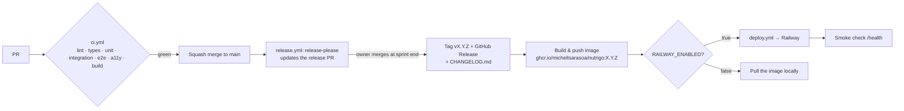

# Release and deployment

## 1. Versioning

- **SemVer** `MAJOR.MINOR.PATCH`. The whole monorepo shares one version (ADR-0005, ADR-0007).
- `0.x` until v1.0.0. **Each sprint = one minor** (`0.2.0`, `0.3.0`, …), and **hotfix = patch**.
- The version comes from Conventional Commits:

| Commit type | Bump (pre-1.0) | In changelog |
|---|---|---|
| `feat:` | minor | Features |
| `fix:` / `perf:` | patch | Bug fixes / Performance |
| `feat!:` / `BREAKING CHANGE:` | minor (pre-1.0), major after | Breaking |
| `docs:` `test:` `refactor:` `chore:` `ci:` | none | hidden |

## 2. Pipeline

## 3. Sprint release checklist (`/cut-release`)

1. Every issue in the sprint milestone is Done or moved to the next milestone.
2. CI is green on `main`.
3. Review the release-please PR: is the changelog readable, and is the version the expected minor?
4. From Sprint 4: run the **restore drill**: restore the latest backup locally, then `npm run test:e2e:smoke`.
5. Merge the release PR. This creates the tag, the GitHub Release and the image, and deploys.
6. Check `/health` on the deployment, then close the milestone.

## 4. Hotfix

Branch `fix/…` from `main`, then PR and merge. release-please proposes `X.Y.(Z+1)`. Merge that release PR right away.

## 5. Rollback

- **Code**: re-run `deploy.yml` (workflow_dispatch) with the previous tag. Images are immutable per version.
- **Data**: migrations only go forward. If a release corrupts data, restore the pre-deploy backup and deploy the previous tag.

## 6. Environments

| Env | URL | Data | Playground |
|---|---|---|---|
| Dev | `localhost:5173` | `./data/dev.db` | on |
| Local prod-like | `localhost:3000` via compose | `./data/nutrigo.db` | off |
| Production (S4+) | Railway domain behind edge protection | Railway volume `/data` | off |
