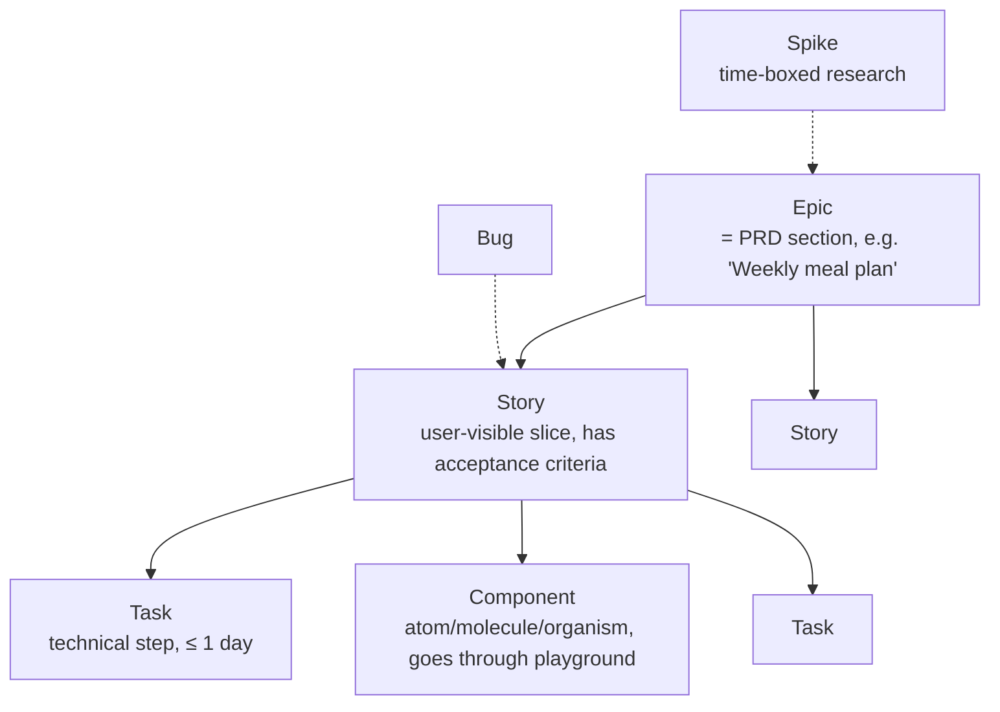
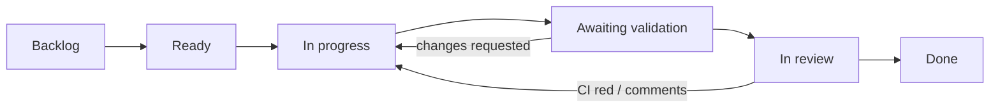
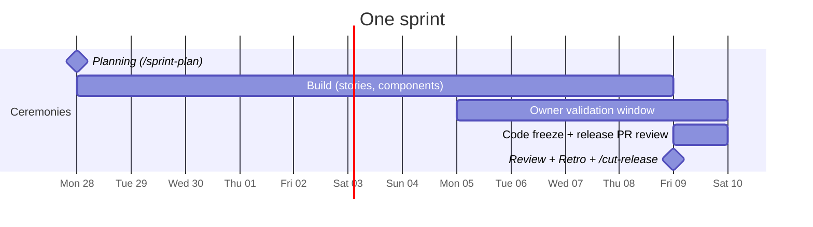
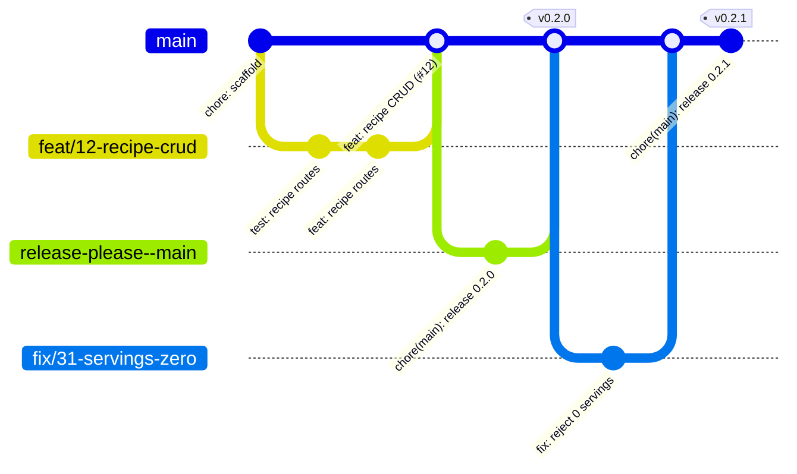

# Agile workflow

This is a lightweight Scrum for a team of one (plus agents). Sprints last **2 weeks**, and each one **ships a version**.

## 1. Work item hierarchy

| Type | Template | Size field | Example |
|---|---|---|---|
| Epic | `epic.yml` | n/a | "Shopping list" |
| Story | `story.yml` | XS–L | "As the owner I can tick items off offline" |
| Component | `component.yml` | XS–M | "Molecule: MacroBadge" |
| Task | `task.yml` | XS–M | "Add shopping_item migration" |
| Bug | `bug.yml` | XS–M | n/a |
| Spike | `spike.yml` | time box | "OFF vs USDA for French products" |

Stories and tasks are linked to their epic as GitHub **sub-issues**.

## 2. GitHub setup

Run `scripts/setup-github.sh` once. It creates:
- **Project (v2) board "NutriGo"** with a `Stage` field and a `Size` field (and a manual step to add a 2-week `Sprint` iteration field)
- **Milestones** `Sprint 0 … Sprint 5`, each due on the sprint's last day. The milestone is the sprint's release scope
- **Labels**: type (`type:story`, …), level (`level:atom`, …), `awaiting-validation`, `design-approved`, `tech-debt`, `blocked`, priority (`P0`–`P2`)

### Board columns (`Stage` field)

| Column | Entry rule |
|---|---|
| Backlog | Anything captured |
| Ready | Meets the **Definition of Ready** |
| In progress | Branch exists; at most **2** items in progress (WIP limit) |
| Awaiting validation | UI only: playground demo ready, label `awaiting-validation` |
| In review | PR open, CI green |
| Done | Meets the **Definition of Done** and is merged |

## 3. Definition of Ready (DoR)

- [ ] Clear title and type; linked to an epic
- [ ] Acceptance criteria written (Given/When/Then for stories)
- [ ] Spec exists and is `Approved` (features), or a design link exists (components)
- [ ] Sized S or smaller (split it if larger)
- [ ] Dependencies are done or in the same sprint

## 4. Definition of Done (DoD)

- [ ] Tests written first; unit, integration and e2e tests as relevant; CI green
- [ ] Coverage thresholds met
- [ ] UI: `design-approved` by the owner; screenshot baseline committed; axe passes
- [ ] `/ponytail-review` clean
- [ ] Docs updated (spec status, data model, ADR, CLAUDE.md)
- [ ] Squash-merged with a Conventional Commit title; issue closed

## 5. Sprint cadence (2 weeks)

| Event | When | Output |
|---|---|---|
| **Planning** | Day 1 | Sprint goal (one sentence in the milestone description); issues moved to Ready in the milestone |
| **Daily check** | When working | Update the board; the WIP limit holds |
| **Validation window** | Days 6–10 | The owner approves playground components in batches |
| **Freeze** | Day 10 | Only fixes; the release-please PR is reviewed |
| **Review + release** | Day 10 (last) | `/cut-release` merges the release PR; tag, GitHub Release, deploy |
| **Retro** | Day 10 | Notes in the milestone; `/ponytail-debt` → `tech-debt` issues for the next sprint |

Items still open at the end of the sprint move to the next milestone. The release still ships what is Done.

## 6. Branching

This is trunk-based development with short-lived branches and squash merges.

- Branch names: `feat/<issue>-slug`, `fix/…`, `docs/…`, `refactor/…`, `chore/…`, `test/…`, `ci/…`.
- `main` is protected: a PR, green CI and linear history are required, and force pushes are blocked.
