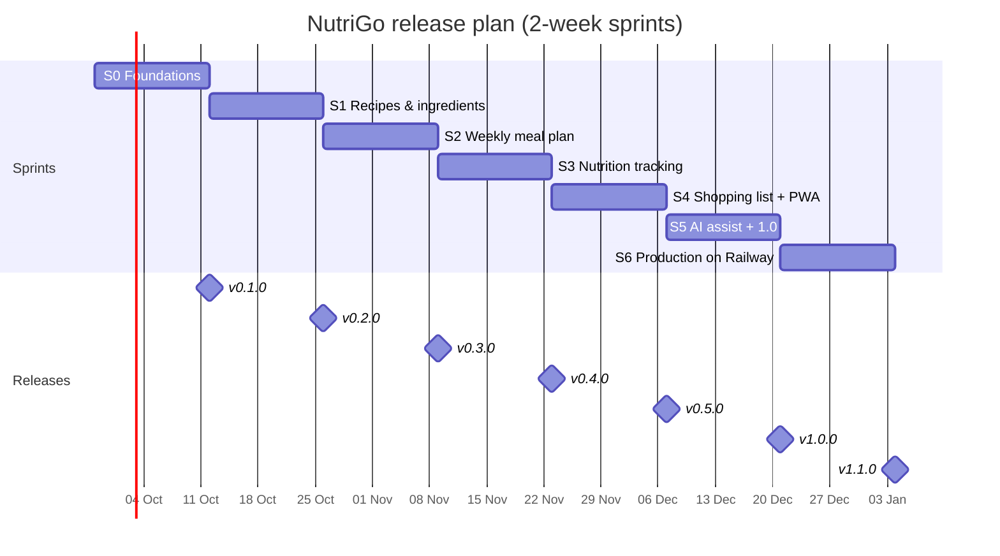
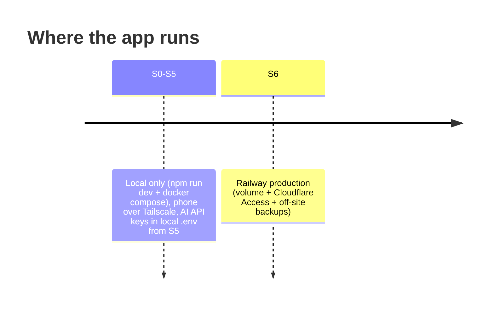

# Roadmap

There is one sprint every two weeks, and each sprint ships one minor version. The start date below is a proposal and can be changed in `scripts/setup-github.sh`.

| Sprint | Version | Goal | PRD refs | Done when |
|---|---|---|---|---|
| S0 | v0.1.0 | Foundations: monorepo, CI/CD, Docker, tokens, atoms in `/playground`, board | G4 | CI green, `docker compose up` serves the playground, atoms approved |
| S1 | v0.2.0 | Recipes & ingredients (manual nutrition entry); **Settings** modal with the locale | R-1…R-9, C-1 | CRUD works end to end on a phone |
| S2 | v0.3.0 | Weekly meal plan screen | P-1…P-4 | A week can be planned from recipes |
| S3 | v0.4.0 | Today screen: nutrition totals, targets, charts, **food diary check-off**; CIQUAL + Open Food Facts import; Settings: nutrition sources | N-1…N-6, C-2 | Daily and weekly nutrition visible against targets |
| S4 | v0.5.0 | Shopping list with **costs in EUR**, offline PWA | S-1…S-7 | List usable offline in the store (on the local deployment) |
| S5 | v1.0.0 | AI-assisted plan and nutrient estimates (Claude, Mistral or DeepSeek), Settings: AI provider and spend cap, hardening | A-1…A-5, C-3, C-4 | All Must requirements are met locally, and the backup/restore has been tested |
| S6 | v1.1.0 | **Production on Railway**: volume, Cloudflare Access, off-site backups, deploy pipeline on | D-1…D-4 | Prod URL live and protected; restore drill passes against a prod backup |

