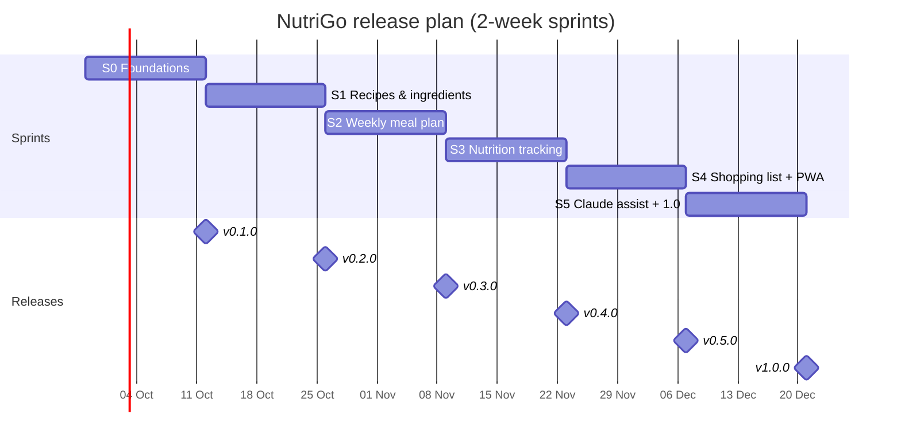
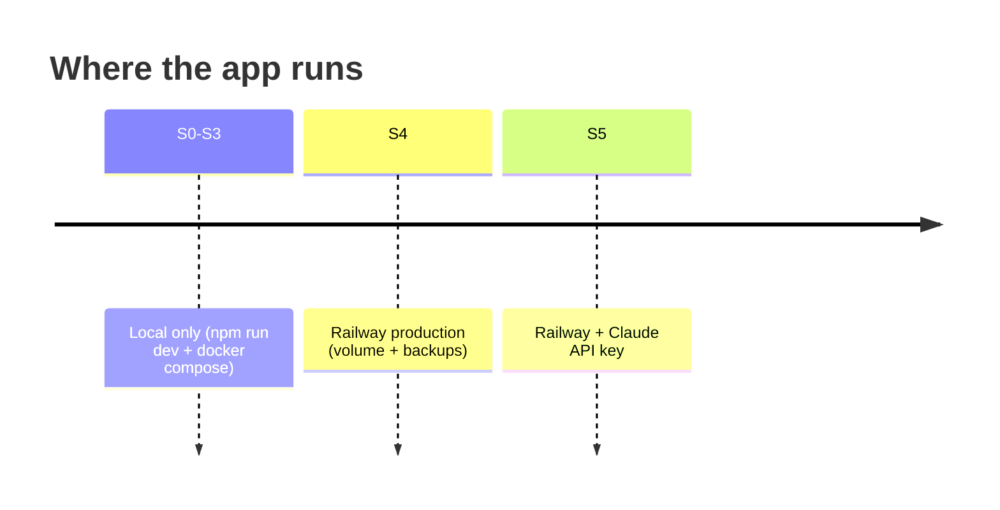

# Roadmap

There is one sprint every two weeks, and each sprint ships one minor version. The start date below is a proposal and can be changed in `scripts/setup-github.sh`.

| Sprint | Version | Goal | PRD refs | Done when |
|---|---|---|---|---|
| S0 | v0.1.0 | Foundations: monorepo, CI/CD, Docker, tokens, atoms in `/playground`, board | G4 | CI green, `docker compose up` serves the playground, atoms approved |
| S1 | v0.2.0 | Recipes & ingredients (manual nutrition entry) | R-1…R-5 | CRUD works end to end on a phone |
| S2 | v0.3.0 | Weekly meal plan screen | P-1…P-4 | A week can be planned from recipes |
| S3 | v0.4.0 | Nutrition totals, targets, charts; Open Food Facts/USDA import | N-1…N-4 | Daily and weekly nutrition visible against targets |
| S4 | v0.5.0 | Shopping list, offline PWA, **first Railway deploy** | S-1…S-4 | List usable offline in the store; prod URL live and protected |
| S5 | v1.0.0 | Claude-assisted plan and nutrient estimates, hardening | A-1…A-3 | All Must requirements are met, and the backup/restore has been tested |

