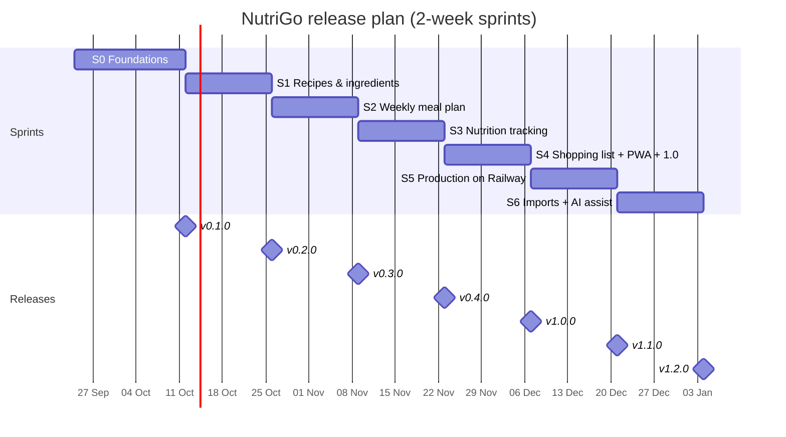
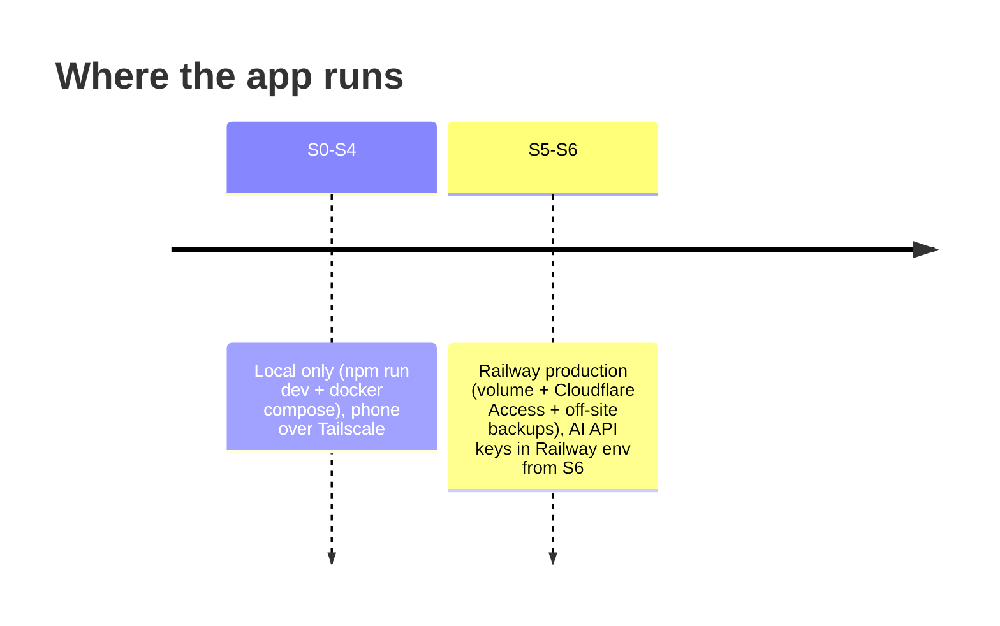

# Roadmap

There is one sprint every two weeks, and each sprint ships one minor version. Sprint 0 started early, on Thu 24 Sep 2026, and runs 18 days so every later sprint starts on a Monday.

```mermaid
gantt
    title NutriGo release plan (2-week sprints)
    dateFormat YYYY-MM-DD
    axisFormat %d %b
    section Sprints
    S0 Foundations            :s0, 2026-09-24, 18d
    S1 Recipes & ingredients  :s1, after s0, 14d
    S2 Weekly meal plan       :s2, after s1, 14d
    S3 Nutrition tracking     :s3, after s2, 14d
    S4 Shopping list + PWA + 1.0 :s4, after s3, 14d
    S5 Production on Railway  :s5, after s4, 14d
    S6 Imports + AI assist    :s6, after s5, 14d
    section Releases
    v0.1.0 :milestone, after s0, 0d
    v0.2.0 :milestone, after s1, 0d
    v0.3.0 :milestone, after s2, 0d
    v0.4.0 :milestone, after s3, 0d
    v1.0.0 :milestone, after s4, 0d
    v1.1.0 :milestone, after s5, 0d
    v1.2.0 :milestone, after s6, 0d
```

The MVP (v1.0.0) is S1–S4 (ADR-0014).

| Sprint | Version | Goal | PRD refs | Done when |
|---|---|---|---|---|
| S0 | v0.1.0 | Foundations: monorepo, CI/CD, Docker, tokens, atoms in `/playground`, board | G4 | CI green, `docker compose up` serves the playground, atoms approved |
| S1 | v0.2.0 | Recipes & ingredients (manual nutrition entry); **Settings** modal with the locale | R-1…R-9, C-1 | CRUD works end to end on desktop, without breaking on a phone (ADR-0013) |
| S2 | v0.3.0 | Weekly meal plan screen | P-1…P-4 | A week can be planned from recipes |
| S3 | v0.4.0 | Today screen: nutrition totals, targets, charts, **food diary check-off** | N-1…N-3, N-5, N-6 | Daily and weekly nutrition visible against targets |
| S4 | v1.0.0 | Shopping list with **costs in EUR**, offline PWA, hardening | S-1…S-7 | List usable offline (local deployment); all Must requirements met locally (except D-*); backup/restore tested |
| S5 | v1.1.0 | **Production on Railway**: volume, Cloudflare Access, off-site backups, deploy pipeline on | D-1…D-4 | Prod URL live and protected; restore drill passes against a prod backup |
| S6 | v1.2.0 | CIQUAL + Open Food Facts import; AI-assisted plan and nutrient estimates (Claude, Mistral or DeepSeek); Settings: nutrition sources, AI provider and spend cap | N-4, C-2, A-1…A-5, C-3, C-4 | Import and AI work in production, under the spend cap |

```mermaid
timeline
    title Where the app runs
    S0-S4 : Local only (npm run dev + docker compose), phone over Tailscale
    S5-S6 : Railway production (volume + Cloudflare Access + off-site backups), AI API keys in Railway env from S6
```
