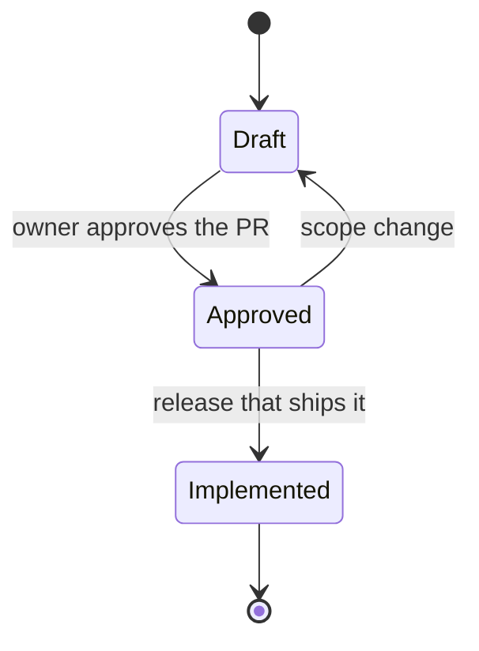

# Specs

There is one spec per feature or story group, named `SPEC-NNN-slug.md` and copied from [`_TEMPLATE.md`](_TEMPLATE.md) (or produced with `/write-spec`).

| Spec | Sprint | Status |
|---|---|---|
| [SPEC-001 Foundations](SPEC-001-foundations.md) | S0 | Draft |
| SPEC-002 Recipes & ingredients | S1 | not written (needs the design system) |
| SPEC-003 Weekly meal plan | S2 | not written (needs the Meal Plan design) |
| SPEC-004 Nutrition tracking | S3 | not written |
| SPEC-005 Shopping list & offline | S4 | not written |
| SPEC-006 Claude assist | S5 | not written |
