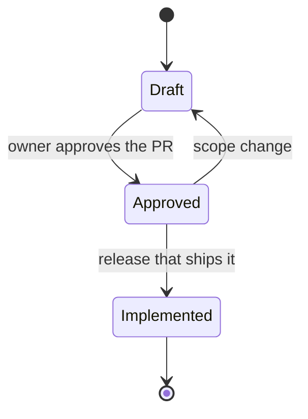

# Specs

There is one spec per feature or story group, named `SPEC-NNN-slug.md` and copied from [`_TEMPLATE.md`](_TEMPLATE.md) (or produced with `/write-spec`).

| Spec | Sprint | Status |
|---|---|---|
| [SPEC-001 Foundations](SPEC-001-foundations.md) | S0 | Approved |
| [SPEC-002 Recipes & ingredients](SPEC-002-recipes-ingredients.md) | S1 | Draft |
| [SPEC-003 Weekly meal plan](SPEC-003-meal-plan.md) | S2 | Draft |
| [SPEC-004 Today, nutrition & food diary](SPEC-004-today-nutrition-diary.md) | S3 | Draft |
| [SPEC-005 Grocery list, costs & offline](SPEC-005-grocery-list.md) | S4 | Draft |
| SPEC-006 AI assist (Claude, Mistral, DeepSeek; ADR-0010) | S5 | not written |
| SPEC-007 Production on Railway | S6 | not written |
| [SPEC-008 Settings](SPEC-008-settings.md) | S1 → S3 → S5 (staged) | Draft |
