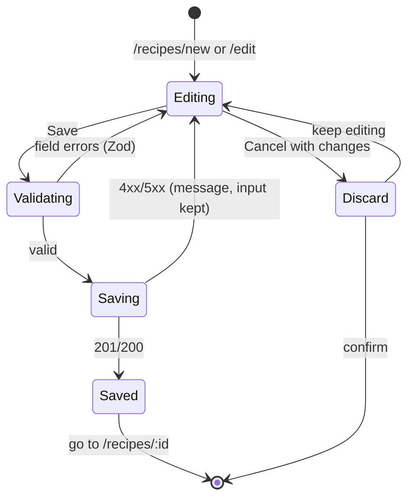

# SPEC-002: Recipes & ingredients

| | |
|---|---|
| Status | Approved (2026-09-25) |
| Sprint | S1 → v0.2.0 |
| PRD refs | R-1 … R-9 |
| Design | `design/source/Healthy Menu.dc.html` (list) · `design/source/Recipe Details.dc.html` (detail) · editors: derived, not in design |

## 1. Summary
Your personal recipe library. You can browse, search and filter recipes and open one to see its ingredients (scaled by servings), steps, tools, notes and nutrition per serving. You also create and edit recipes and ingredients, entering nutrition by hand. Imports from CIQUAL and Open Food Facts come in Sprint 3 (SPEC-004, ADR-0011).

## 2. User stories
- **US-1** As the owner, I can add an ingredient with its nutrition per 100 g, so recipes can compute nutrition.
- **US-2** As the owner, I can create a recipe from ingredients and steps, so I can plan it later.
- **US-3** As the owner, I can browse, search and filter my recipes by meal type, and sort them.
- **US-4** As the owner, I can open a recipe, change the servings and see scaled quantities with nutrition per serving.
- **US-5** As the owner, I can rate my own recipe (1–5) and see a computed health score.

## 3. Acceptance criteria
| ID | Given | When | Then |
|---|---|---|---|
| AC-1 | No ingredients | I save "Oats" with 389 kcal, 66 g carbs, 17 g protein, 7 g fat per 100 g, category Grains | It appears in the ingredient list with source "manual" |
| AC-2 | The ingredient form | I enter a negative value or leave kcal empty | Field errors are shown and nothing is saved |
| AC-3 | Ingredients exist | I create a recipe with 2 servings, 3 ingredients and 2 titled steps | It is listed under its meal type; kcal and macros per serving match the unit tests of `nutritionPerServing` |
| AC-4 | 10 recipes | I type "chick" in search | Only recipes whose name contains "chick" (case-insensitive) are shown |
| AC-5 | Recipes of several meal types | I pick the "Lunch" filter tab | Only lunch recipes are shown; "All" restores the full list |
| AC-6 | A recipe for 2 servings with 200 g turkey | I press + on Total Servings | It shows 3; the quantity becomes 300 g; nutrition **per serving** is unchanged |
| AC-7 | The recipe list | I switch between list and grid views | The layout changes and the choice is remembered on this device |
| AC-8 | A recipe used in a meal plan | I try to delete it | I get a message that it's planned (409) and nothing is deleted. **Moved to SPEC-003 (S2)**: it needs the `meal_entry` table; in S1 a recipe deletes freely |
| AC-9 | An ingredient used in a recipe | I try to delete it | I get a message listing the recipes that use it (409) |
| AC-10 | A 390 px wide screen | I open the list, the detail page and the editor | Everything fits in one column; no horizontal scroll; tap targets ≥ 44 px |

## 4. UI

### Screens and routes
| Route | Screen | Source |
|---|---|---|
| `/recipes` | Recipe list: search, filter tabs (All / Breakfast / Lunch / Snack / Dinner), sort (Name, Calories, Health score, Total time, Rating), list/grid toggle, "Add recipe" | Healthy Menu (the Featured card, Popular and Recommended panels are removed) |
| `/recipes/:id` | Detail: hero, meta list (prep, cook, difficulty, steps, health score), title, meal-type pill, description, tools, directions, notes, servings stepper, ingredients, macro tiles, nutrition facts, "Add to meal plan" | Recipe Details (Reviews, Eat time and Vitamin C are removed) |
| `/recipes/new`, `/recipes/:id/edit` | Recipe editor | **Derived** |
| `/ingredients`, `/ingredients/new`, `/ingredients/:id` | Ingredient list and editor | **Derived** |

Mobile (<768 px): the list is a single column of MenuListItem cards. On the detail page the order is hero → title and meal type → macro tiles → servings and ingredients → directions → tools → notes → nutrition facts.

### Component inventory (bottom-up; the ✔ column means the component already exists)
| Level | Component | ✔ | States to show in the playground |
|---|---|---|---|
| Atom | Button, Pill, IconBadge, SearchField, Stepper, StarRating, SelectPill, NavLink | S0 | as in SPEC-001 |
| Atom | Field (text, number with a unit suffix, multi-line: one atom, S1 decision), Select | new | empty, filled, focus, error, disabled |
| Atom | Segmented (list/grid), FilterTabs | new | each option active; keyboard |
| Molecule | MenuListItem (list and grid variants) | new | with/without photo, long title, no rating |
| Molecule | MetaList row | new | each meta type, missing value "–" |
| Molecule | MacroTile ×4 | new | typical, 0, large numbers |
| Molecule | IngredientRow, RecipeStep, ToolItem, NoteItem, NutritionRow | new | long text, scaled quantity |
| Molecule | PhotoOrPlaceholder | new | own photo, ingredient mosaic, placeholder by meal type |
| Organism | RecipeList | new | empty library, no search results, 1 item, many |
| Organism | RecipeDetail | new | full, minimal (no steps or tools), loading, not found |
| Organism | RecipeEditor, IngredientEditor | new | new, edit, validation errors, saving, server error |
| Page | RecipesPage, RecipePage, RecipeEditPage, IngredientsPage | new | n/a |

### Editor flow

## 5. API
| Method | Path | Request | Response | Errors |
|---|---|---|---|---|
| GET | `/api/ingredients?q=` | n/a | `Ingredient[]` | n/a |
| POST | `/api/ingredients` | `IngredientInput` | 201 `Ingredient` | 400, 409 (name exists) |
| GET/PATCH/DELETE | `/api/ingredients/:id` | `IngredientPatch` | `Ingredient` / 204 | 404, 409 (used by recipes) |
| GET | `/api/recipes?q=&mealType=&sort=` | n/a | `RecipeSummary[]` (with kcal/serving, health score, total time) | 400 |
| POST | `/api/recipes` | `RecipeInput` (ingredients, steps and tools included) | 201 `Recipe` | 400 |
| GET | `/api/recipes/:id` | n/a | `Recipe` + `nutritionPerServing` + `healthScore` | 404 |
| PATCH | `/api/recipes/:id` | `RecipeInput` (full replace of lists, in one transaction) | `Recipe` | 400, 404 |
| DELETE | `/api/recipes/:id` | n/a | 204 | 404, 409 (planned) |
| POST | `/api/recipes/:id/photo` | `multipart/form-data` image ≤ 5 MB (jpeg/png/webp) | `{ photoPath }` | 400, 413 |

## 6. Data
The tables `ingredient`, `recipe`, `recipe_ingredient`, `recipe_step` and `recipe_tool` are defined in `data-model.md`. Photos are stored in `/data/photos/`, next to the DB, and covered by the backup.

## 7. Business rules (`packages/shared`)
| Function | Rule | Example |
|---|---|---|
| `toGrams(qty, unit, ingredient)` | g → g; ml → uses `grams_per_unit` (defaults to 1 g/ml); piece → `grams_per_unit` (required, otherwise a validation error) | 2 eggs × 50 g = 100 g |
| `nutritionPerServing(recipe)` | Σ(grams × per100g ÷ 100) ÷ servings, for each nutrient; rounded only for display | 200 g turkey (135 kcal/100 g) for 2 servings → 135 kcal |
| `scaleQuantities(recipe, servings)` | quantity × servings ÷ recipe.servings; display ≤ 2 decimals | 200 g at 2 → 300 g at 3 |
| `totalTime(recipe)` | prep + cook; null if both are missing | 10 + 15 = 25 min |
| `healthScore(nutrition, categories)` (approved, PRD Q8) | Start 5. +2 if protein ≥ 20 g; +1 if fibre ≥ 5 g; +1 if 300 ≤ kcal ≤ 700; +1 if ingredients span ≥ 3 food categories; −1 if sugars > 15 g; −1 if sodium > 800 mg; −1 if fat supplies > 40 % of kcal. Clamp to 0–10. A missing optional nutrient counts as 0 | Turkey, rice, asparagus → 9 |

## 8. Out of scope
Tags (no tables, no UI; the meal type covers the filters, S1 decision), reviews and rating counts, Popular and Recommended panels, the featured recipe, importing a recipe from a URL, sharing, Vitamin C and % daily values.

## 9. Test plan
| Layer | What |
|---|---|
| Unit | `toGrams`, `nutritionPerServing`, `scaleQuantities`, `totalTime`, `healthScore` (a table of cases, edge cases 0 and missing values) |
| Integration | Every route, happy path and each error code; transactional PATCH (a failure leaves the old recipe intact) |
| Component | Every molecule and organism listed above, in every state, with axe |
| E2E | AC-1 … AC-10 (AC-8 in S2), run on mobile (390 px) and desktop viewports |

## 10. Open questions
- ~~Q6 (PRD): recipe photo source beyond your own uploads.~~ **Your own uploads are the main source**; the ingredient mosaic and meal-type placeholder stay as fallbacks (resolved 2026-09-23).
- ~~Q8 (PRD): health-score formula above; approve or change it.~~ **Approved** as written (resolved 2026-09-23).
- ~~Are tags still needed, given the meal type covers the design's filters?~~ **No tags in S1**: no tables and no UI. They come back with a tag filter when one is really needed (R-4 is a Should) (resolved 2026-09-24).
