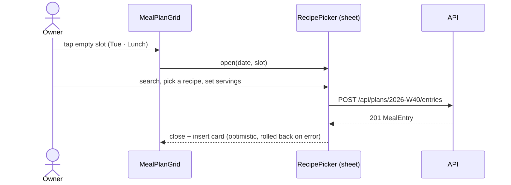

# SPEC-003: Weekly meal plan

| | |
|---|---|
| Status | Draft |
| Sprint | S2 → v0.3.0 |
| PRD refs | P-1 … P-4 |
| Design | `design/source/Meal Plan.dc.html` (desktop grid + mobile day view) |

## 1. Summary
Plan the week, Monday to Sunday, by putting recipes into four slots per day: breakfast, lunch, snack and dinner. Desktop shows the 7-day grid from the design. Mobile shows a week strip and one day, as in the design's mobile variant. Nutrition totals and the eaten check-off come in SPEC-004. This spec only shows planned kcal.

## 2. User stories
- **US-1** As the owner, I can see a week with 4 slots per day and move between weeks.
- **US-2** As the owner, I can add a recipe to a slot with a number of servings.
- **US-3** As the owner, I can move, duplicate, change servings of or remove a planned meal.
- **US-4** As the owner, I can copy the previous week into an empty week.

## 3. Acceptance criteria
| ID | Given | When | Then |
|---|---|---|---|
| AC-1 | Today is Wed 2026-09-30 | I open `/plan` | I am redirected to `/plan/2026-W40`; columns run Mon 28 → Sun 4; today's header is highlighted |
| AC-2 | Week 2026-W40 | I press "next week" | The URL becomes `/plan/2026-W41` and the label reads "Oct 5 – 11, 2026" |
| AC-3 | An empty slot (Tue, Lunch) | I tap the "+" slot, search for and pick a recipe, and keep 1 serving | The slot shows the MealMiniCard with the recipe name and kcal for 1 serving |
| AC-4 | A planned meal | I change its servings to 2 | The kcal shown doubles |
| AC-5 | A planned meal | I choose "Move" and pick Thu, Dinner | It disappears from the old slot and appears in the new one |
| AC-6 | A planned meal | I choose "Remove" and confirm | The slot shows "+" again |
| AC-7 | W40 has meals and W41 is empty | On W41 I choose "Copy previous week" | Every W40 entry is created on the same weekday and slot of W41 |
| AC-8 | W41 already has meals | I choose "Copy previous week" | I am asked to confirm replace or merge; nothing changes if I cancel |
| AC-9 | A slot with 2 recipes (e.g. a main and a side) | I view it | Both cards are stacked in `position` order; slot kcal = sum |
| AC-10 | A 390 px screen | I open `/plan/2026-W40` | I see the week strip (Mon–Sun) and the selected day's 4 slot groups; tapping a day switches the view with no page reload |
| AC-11 | The grid on desktop | I use only the keyboard | Every slot and card can be reached; Enter opens the add or actions sheet |

## 4. UI
| Route | Desktop ≥1200 px | Mobile <768 px |
|---|---|---|
| `/plan/:isoWeek` | PageHeader (title, WeekNav, "Add meal") + MealPlanGrid: a slot column (pill + planned kcal) × 7 day columns | Top bar + WeekStrip + DayMealsPanel (the MealGroup per slot, with MealItems and an add button) |

**Changes from the design:** weeks start Monday (not Sunday). The slot column's kcal is the **planned total for the selected day** (the design shows a fixed number). Snack is a grey pill. The notification bell and user menu are removed. The design's "Add Meal" button links to the recipe list; here it opens the picker for the selected day.

### Add / actions flow

### Component inventory
| Level | Component | New? | States |
|---|---|---|---|
| Atom | Pill (slot variants), Button, Stepper, IconButton | existing | n/a |
| Molecule | WeekNav | new | current week, other week, loading |
| Molecule | DayHead | new | normal, today, selected |
| Molecule | MealMiniCard | new | with/without photo, long name, 2+ servings badge, focused |
| Molecule | MealAddSlot | new | idle, hover/focus, drop target (future) |
| Molecule | WeekStrip | new | today, selected ≠ today, week boundary |
| Molecule | MealGroup / MealItem (planned state, no check yet) | new | empty slot, 1 item, 2 items |
| Organism | MealPlanGrid | new | empty week, full week, partially filled, loading, error |
| Organism | DayMealsPanel | new | empty day, full day |
| Organism | RecipePicker (bottom sheet on mobile, dialog on desktop) | new | search, no results, picking servings |
| Organism | MealActionsMenu (move / duplicate / servings / remove) | new | each action |
| Page | PlanPage | new | n/a |

## 5. API
| Method | Path | Request | Response | Errors |
|---|---|---|---|---|
| GET | `/api/plans/:isoWeek` | n/a | `{ isoWeek, days: [{ date, slots: { breakfast: MealEntry[], … } }] }` | 400 (bad week) |
| POST | `/api/plans/:isoWeek/entries` | `{ date, slot, recipeId, servings }` | 201 `MealEntry` | 400 (date outside week), 404 recipe |
| PATCH | `/api/plans/:isoWeek/entries/:id` | `{ date?, slot?, servings?, position? }` | `MealEntry` | 400, 404 |
| DELETE | `/api/plans/:isoWeek/entries/:id` | n/a | 204 | 404 |
| POST | `/api/plans/:isoWeek/copy-from/:otherWeek` | `{ mode: "replace" \| "merge" }` | `Plan` | 400, 404 |

Moving a meal to another week uses DELETE + POST. Duplicating uses a POST with the same data.

## 6. Data
The tables `plan_week` and `meal_entry` are defined in `data-model.md`. A `plan_week` row is created lazily on the first entry.

## 7. Business rules (`packages/shared`)
| Function | Rule | Example |
|---|---|---|
| `isoWeekOf(date)` | ISO 8601, Monday start; week 1 contains Jan 4 | 2026-09-30 → 2026-W40 |
| `weekDays(isoWeek)` | 7 dates Mon → Sun | 2026-W40 → 2026-09-28 … 2026-10-04 |
| `weekLabel(isoWeek)` | "Sep 28 – Oct 4, 2026"; months shown on both sides when they differ | n/a |
| `plannedKcal(entries)` | Σ recipe kcal/serving × servings | n/a |
| `copyWeek(from, to, mode)` | Keep the weekday offset and slot; `replace` deletes the target's entries first (one transaction) | n/a |

## 8. Out of scope
Drag and drop (a later improvement; actions menu for now), eaten check-off (SPEC-004), nutrition totals and targets (SPEC-004), AI suggestions (SPEC-006).

## 9. Test plan
| Layer | What |
|---|---|
| Unit | ISO week functions around year boundaries (2026 has a W53 because it starts on a Thursday; 2026-12-31 → 2026-W53; 2027-W01), DST changes, `copyWeek` |
| Integration | All routes; copy replace vs merge; date outside the week → 400 |
| Component | All components above, with mobile and desktop playground frames |
| E2E | AC-1 … AC-11, with the clock fixed at 2026-09-30 |

## 10. Open questions
- Should the desktop grid also show daily kcal totals under each day header? The design doesn't have them; proposal: yes, as a caption line.
