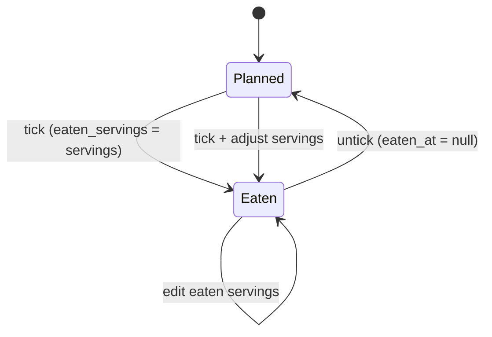
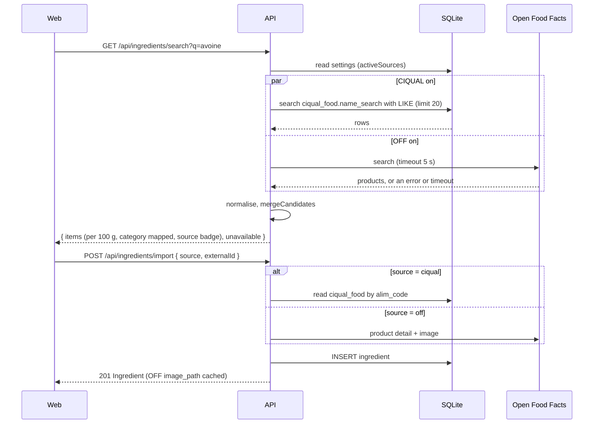

# SPEC-004: Today, nutrition tracking & food diary

| | |
|---|---|
| Status | Draft |
| Sprint | S3 → v0.4.0 |
| PRD refs | N-1 … N-6, §5.7 (sources: ADR-0011; the on/off switches are C-2 in SPEC-008) |
| Design | `design/source/Dashboard.dc.html` + `Dashboard Mobile.dc.html` (only the calories card, macro bars and day meals are kept) |

## 1. Summary
The home screen, "Today", answers three questions: what am I eating today, have I eaten it, and where am I against my targets? It shows the calories ring, the macro bars and the day's meals with check-off, plus a week trend. It also sets personal targets and imports ingredients from **CIQUAL** (the ANSES French generic food table, bundled in the DB, works offline) and **Open Food Facts** (branded products, live). One search covers the sources that are on in Settings and merges their results into one ranked list (ADR-0011, SPEC-008).

## 2. User stories
- **US-1** As the owner, I can tick a planned meal as eaten, optionally with a different serving count.
- **US-2** As the owner, I can see kcal eaten, planned and left against my target, plus macros eaten against their targets.
- **US-3** As the owner, I can see this week's daily kcal against my target.
- **US-4** As the owner, I can set my daily targets (kcal, carbs, protein, fat).
- **US-5** As the owner, I can search CIQUAL and Open Food Facts at once and import an ingredient with its nutrition and category (and, from Open Food Facts, its image).

## 3. Acceptance criteria
| ID | Given | When | Then |
|---|---|---|---|
| AC-1 | Target 2 990 kcal; today has 4 planned meals totalling 2 150 kcal; none ticked | I open `/` | The ring shows "2 990 kcal left", eaten 0, planned 2 150 |
| AC-2 | Same | I tick Breakfast (300 kcal) | The check turns green (done); eaten = 300; left = 2 690; carbs, protein and fat bars update |
| AC-3 | Same | I tick Lunch and set eaten servings to 1.5 (450 kcal for 1) | eaten increases by 675 |
| AC-4 | A ticked meal | I untick it | It returns to planned; the totals revert |
| AC-5 | Eaten > target | View the ring | Full orange ring, text "+N kcal over ▲" (dataviz rules) |
| AC-6 | No targets set | Open `/` | Totals are shown without a ring; a CTA links to `/targets` |
| AC-7 | `/targets` | I save kcal 2 990, carbs 325, protein 75, fat 44 | The values persist and Today reflects them |
| AC-8 | The week trend on Wed | View it | Mon and Tue show eaten kcal (solid); Wed–Sun show planned (hatched); over-target days are orange with ▲ in the tooltip |
| AC-9 | The ingredient editor; both sources on | I search "avoine" and pick an Open Food Facts product | The form is pre-filled (per 100 g nutrition, category, image), with source `off` and the barcode as `external_id`; I can edit it before saving |
| AC-10 | Both sources on; OFF is unreachable | I search "avoine" | The CIQUAL results show, with the notice "Open Food Facts is unavailable, showing CIQUAL only"; "Enter manually" stays offered; nothing crashes |
| AC-11 | The next unticked meal after the current time | View the meal list | Its check is outlined in orange ("next meal"), as in the design |
| AC-12 | The ingredient editor; both sources on | I search "courgette" and pick a CIQUAL item | The form is pre-filled (per 100 g nutrition, category `veggies`), with source `ciqual`, its `alim_code` as `external_id` and no image; I can edit it before saving |
| AC-13 | Only OFF on (CIQUAL off in Settings); OFF is unreachable | I search | A friendly error with "Enter manually"; nothing crashes |

The source switches, the merged ranking with source badges and the "both off" case are SPEC-008 AC-4…AC-6. They're tested against this import sheet from S3.

## 4. UI
| Route | Desktop | Mobile |
|---|---|---|
| `/` (Today) | Main: CaloriesCard + WeekTrend. Aside (≥1440 px): WeekStrip + DayMealsPanel with checks | Top bar, CaloriesCard, DayMealsPanel, WeekTrend, tab bar |
| `/targets` | A single card form | Same |

**Kept from the Dashboard:** "Calories Intake" (ring and macro bars) and the day meal list with checks. **Removed:** Weight, Steps, Sleep, Water, Weight Data gauge, Workout Progress, Recommended Menu and Exercises, Recent Activity, "Burned calories", greeting and search. **Changed:** the ring caption shows eaten, planned and target; the macro bar colours follow the canonical mapping.

### Check-off flow

### Component inventory
| Level | Component | New? | States |
|---|---|---|---|
| Atom | MealCheck | S0 | done, todo, next, focus, disabled (future day) |
| Molecule | MacroBar | new | 0 %, typical, 100 %, over, no target |
| Molecule | MealItem (with check) | extends S2 | planned, eaten, eaten with different servings |
| Molecule | ServingsPrompt | new | default, custom value, invalid |
| Molecule | ImportCandidate (name, kcal per 100 g, source badge with the `Pill` atom) | new | CIQUAL, OFF with image, OFF without image, long name, focus |
| Organism | Ring (chart) | new | 0, typical, 100 %, over, no target, reduced motion |
| Organism | CaloriesCard | new | the ring states × macro states |
| Organism | ColumnChart (week trend) | new | empty week, mixed eaten/planned, over-target days |
| Organism | TargetsForm | new | empty, filled, errors |
| Organism | IngredientImport (search sheet: merged results with a CIQUAL / OFF source badge, credit line "Open Food Facts · CIQUAL (ANSES)") | new | idle, searching, results, no results, OFF unavailable (CIQUAL results only), upstream error (OFF only), no source on (manual only, link to Settings) |
| Page | TodayPage, TargetsPage | new | n/a |

## 5. API
| Method | Path | Request | Response | Errors |
|---|---|---|---|---|
| POST | `/api/plans/:isoWeek/entries/:id/eaten` | `{ eatenServings? }` | `MealEntry` | 404, 400 |
| DELETE | `/api/plans/:isoWeek/entries/:id/eaten` | n/a | `MealEntry` | 404 |
| GET | `/api/nutrition/day/:date` | n/a | `{ target, planned, eaten, left, macros: {carbs,protein,fat}: {eaten, target} }` | 400 |
| GET | `/api/nutrition/week/:isoWeek` | n/a | `{ days: [{ date, planned, eaten, isPast }] , target }` | 400 |
| GET/PUT | `/api/targets` | `Targets` | `Targets` | 400 |
| GET | `/api/ingredients/search?q=` | n/a | `{ items: ImportCandidate[], unavailable: ("off")[] }`: the candidates from the sources that are on (`activeSources`), normalised per 100 g, each with its `source` and `externalId`, merged and ranked by `mergeCandidates` (SPEC-008 §7). No source on → `{ items: [], unavailable: [] }` | 400 (empty `q`), 502 (only OFF is on and it failed) |
| POST | `/api/ingredients/import` | `{ source: "off" \| "ciqual", externalId }` | 201 `Ingredient` (OFF image cached locally; CIQUAL has no image) | 400, 404 (unknown barcode or `alim_code`), 409, 502 (OFF) |

There's no `source` query parameter: the sources come from Settings. CIQUAL is a local query, so it answers even when the server has no internet. When OFF fails but CIQUAL is on, the search still returns 200 with the CIQUAL items and `unavailable: ["off"]` (AC-10).

## 6. Data
Uses `meal_entry.eaten_at` and `eaten_servings`, the `targets` table, `settings.source_ciqual` and `source_off` (SPEC-008), and `ingredient.source` (`off` or `ciqual` here), `external_id` (OFF barcode or CIQUAL `alim_code`), `image_url` and `image_path` (data-model.md).

One new table, `ciqual_food` (also in data-model.md). It's read-only seed data (ADR-0011):

| Column | Type | Notes |
|---|---|---|
| `alim_code` | integer PK | The CIQUAL food code; becomes `ingredient.external_id` on import |
| `name` | text | `alim_nom_fr`, shown in the results |
| `name_search` | text | `searchKey(name)`: lower case, accents removed. The search runs `LIKE` on it with `searchKey(q)`, because SQLite's `LIKE` ignores case for ASCII only |
| `group_name`, `subgroup_name` | text | `alim_grp_nom_fr`, `alim_ssgrp_nom_fr`, for `mapCiqualGroup` |
| `kcal_100g`, `carbs_100g`, `protein_100g`, `fat_100g` | real | Same meaning as the `ingredient` columns |
| `fibre_100g`, `sugars_100g`, `sodium_mg_100g` | real, nullable | Same as `ingredient` |

- **Seed:** a one-off script (`apps/api/scripts/ciqual-seed.ts`) reads the official CIQUAL release and writes a custom drizzle-kit migration (`drizzle-kit generate --custom`) with the `INSERT`s, about 3,500 rows. The migration name carries the release year. The script parses values with `parseCiqualValue` and leaves out rows missing energy, carbs, protein or fat. It uses no new dependency; if parsing the release needs one, that takes an ADR first.
- **Updating CIQUAL** means a new migration that replaces the rows. The migration never touches `ingredient`.
- An import **copies** the values into `ingredient`. There's no foreign key, so later CIQUAL updates don't rewrite the owner's ingredients or their edits.

## 7. Business rules (`packages/shared`)
| Function | Rule |
|---|---|
| `dayNutrition(entries, recipes, targets)` | planned = Σ over all entries; eaten = Σ over ticked entries using `eaten_servings`; left = target − eaten (may be negative) |
| `macroProgress(eaten, target)` | pct = eaten ÷ target; `over` when pct > 1; display capped at 100 % |
| `nextMealId(entries, now)` | the first unticked entry today in slot order, starting from the slot matching the time (breakfast < 10:30 < lunch < 15:00 < snack < 18:00 < dinner) |
| `mapOffCategory(tags)` | OFF categories → grains / veggies / protein / fruits / dairy / others (a mapping table in the code) |
| `normaliseImport(product)` | Open Food Facts product → `ImportCandidate`: kJ → kcal when needed; salt → sodium (× 0.4 × 1000 mg); rejects products without energy |
| `mapCiqualGroup(group, subgroup)` | CIQUAL group and subgroup names → grains / veggies / protein / fruits / dairy / others (a mapping table in the code), e.g. cereal products → grains, vegetables → veggies, fruits → fruits, meat, eggs, fish and pulses → protein, milk products → dairy, anything else → others |
| `searchKey(text)` | lower case, Unicode NFD, combining marks removed, trimmed: "Épeautre " → "epeautre" |
| `parseCiqualValue(text)` | a CIQUAL cell → number or null: "12,5" → 12.5; "traces" → 0; "< 0,5" → 0; "-" or empty → null |
| `activeSources`, `mergeCandidates` | As defined in SPEC-008 §7, reused here |

## 8. Out of scope
Burned calories, activity, weight, water, sleep, off-plan food logging (the decision was planned vs eaten only), and AI estimates (SPEC-006). USDA (dropped, ADR-0011). Updating CIQUAL from the app (a new release is a new migration). The Settings switches themselves (SPEC-008).

## 9. Test plan
| Layer | What |
|---|---|
| Unit | `dayNutrition` (none, partial and all ticked, custom servings, over target), `nextMealId` with a fixed clock, `normaliseImport` with recorded OFF fixtures, `mapCiqualGroup` (each category and the fallback), `searchKey` (accents, case), `parseCiqualValue` (each case above) |
| Integration | Eaten endpoints, nutrition endpoints, targets validation. Search and import with OFF mocked from recorded fixtures (success, timeout, 5xx) and a few `ciqual_food` fixture rows seeded in the test DB: each source alone, both merged, OFF down with CIQUAL on (200 + `unavailable: ["off"]`), OFF down alone (502), no source on, accent-insensitive CIQUAL match, import from each source, unknown `alim_code` (404) |
| Component | Ring and MacroBar in every dataviz state, CaloriesCard, ColumnChart (with a table view), ImportSheet in every state above |
| E2E | AC-1 … AC-13 (and SPEC-008 AC-4…AC-6), with the clock fixed at Wed 2026-09-30 12:00. OFF is mocked with recorded fixtures; CIQUAL uses the real seed, which ships in a migration. CI never calls OFF |

## 10. Open questions
- Slot time boundaries for "next meal" (proposal above): OK?
- Should ticking a future day's meal be allowed? Proposal: no (disabled), to keep the diary honest.
- When OFF fails but CIQUAL is on, the search returns the CIQUAL items with `unavailable: ["off"]` instead of a 502 (AC-10). OK?
- CIQUAL values below the detection limit: proposal "traces" → 0 and "< x" → 0; "-" → unknown (null), and rows missing energy or a macro are left out of the seed. OK?
- The CIQUAL licence and credit wording are confirmed when writing the seed script (ADR-0011). The proposal is "Open Food Facts · CIQUAL (ANSES)" on the import sheet.
