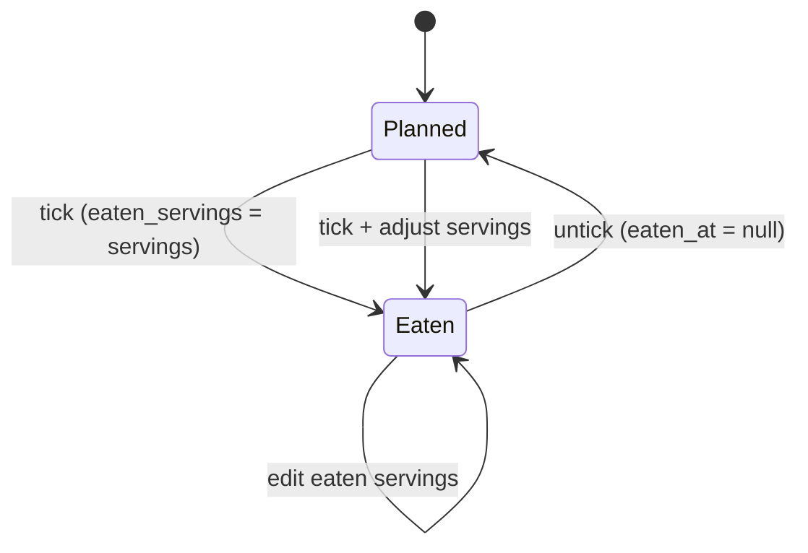
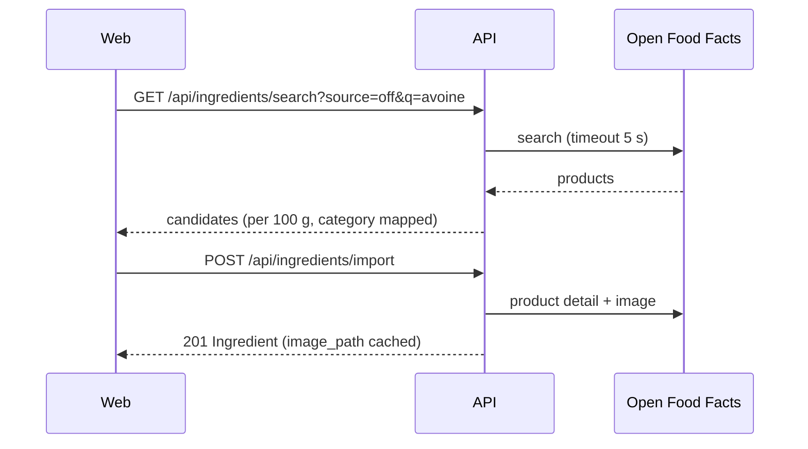

# SPEC-004: Today, nutrition tracking & food diary

| | |
|---|---|
| Status | Draft |
| Sprint | S3 → v0.4.0 |
| PRD refs | N-1 … N-6 |
| Design | `design/source/Dashboard.dc.html` + `Dashboard Mobile.dc.html` (only the calories card, macro bars and day meals are kept) |

## 1. Summary
The home screen, "Today", answers three questions: what am I eating today, have I eaten it, and where am I against my targets? It shows the calories ring, the macro bars and the day's meals with check-off, plus a week trend. It also sets personal targets and imports ingredients from Open Food Facts and USDA.

## 2. User stories
- **US-1** As the owner, I can tick a planned meal as eaten, optionally with a different serving count.
- **US-2** As the owner, I can see kcal eaten, planned and left against my target, plus macros eaten against their targets.
- **US-3** As the owner, I can see this week's daily kcal against my target.
- **US-4** As the owner, I can set my daily targets (kcal, carbs, protein, fat).
- **US-5** As the owner, I can search Open Food Facts or USDA and import an ingredient with its nutrition, category and image.

## 3. Acceptance criteria
| ID | Given | When | Then |
|---|---|---|---|
| AC-1 | Target 2 990 kcal; today has 4 planned meals totalling 2 150 kcal; none ticked | I open `/` | The ring shows "2 990 kcal left", eaten 0, planned 2 150 |
| AC-2 | Same | I tick Breakfast (300 kcal) | The check turns green (done); eaten = 300; left = 2 690; carbs, protein and fat bars update |
| AC-3 | Same | I tick Lunch and set eaten servings to 1.5 (450 kcal for 1) | eaten increases by 675 |
| AC-4 | A ticked meal | I untick it | It returns to planned; the totals revert |
| AC-5 | Eaten > target | View the ring | Full orange ring, text "+N kcal over ▲" (dataviz rules) |
| AC-6 | No targets set | Open `/` | Totals are shown without a ring; a CTA links to `/targets` |
| AC-7 | `/targets` | I save kcal 2 990, carbs 325, protein 75, fat 44 | The values persist and Today reflects them |
| AC-8 | The week trend on Wed | View it | Mon and Tue show eaten kcal (solid); Wed–Sun show planned (hatched); over-target days are orange with ▲ in the tooltip |
| AC-9 | The ingredient editor | I search OFF for "avoine" and pick a product | The form is pre-filled (per 100 g nutrition, category, image), with source `off`; I can edit it before saving |
| AC-10 | OFF is unreachable | I search | A friendly error with "Enter manually"; nothing crashes |
| AC-11 | The next unticked meal after the current time | View the meal list | Its check is outlined in orange ("next meal"), as in the design |

## 4. UI
| Route | Desktop | Mobile |
|---|---|---|
| `/` (Today) | Main: CaloriesCard + WeekTrend. Aside (≥1440 px): WeekStrip + DayMealsPanel with checks | Top bar, CaloriesCard, DayMealsPanel, WeekTrend, tab bar |
| `/targets` | A single card form | Same |

**Kept from the Dashboard:** "Calories Intake" (ring and macro bars) and the day meal list with checks. **Removed:** Weight, Steps, Sleep, Water, Weight Data gauge, Workout Progress, Recommended Menu and Exercises, Recent Activity, "Burned calories", greeting and search. **Changed:** the ring caption shows eaten, planned and target; the macro bar colours follow the canonical mapping.

### Check-off flow

### Component inventory
| Level | Component | New? | States |
|---|---|---|---|
| Atom | MealCheck | S0 | done, todo, next, focus, disabled (future day) |
| Molecule | MacroBar | new | 0 %, typical, 100 %, over, no target |
| Molecule | MealItem (with check) | extends S2 | planned, eaten, eaten with different servings |
| Molecule | ServingsPrompt | new | default, custom value, invalid |
| Organism | Ring (chart) | new | 0, typical, 100 %, over, no target, reduced motion |
| Organism | CaloriesCard | new | the ring states × macro states |
| Organism | ColumnChart (week trend) | new | empty week, mixed eaten/planned, over-target days |
| Organism | TargetsForm | new | empty, filled, errors |
| Organism | IngredientImport (search sheet) | new | idle, searching, results, no results, upstream error |
| Page | TodayPage, TargetsPage | new | n/a |

## 5. API
| Method | Path | Request | Response | Errors |
|---|---|---|---|---|
| POST | `/api/plans/:isoWeek/entries/:id/eaten` | `{ eatenServings? }` | `MealEntry` | 404, 400 |
| DELETE | `/api/plans/:isoWeek/entries/:id/eaten` | n/a | `MealEntry` | 404 |
| GET | `/api/nutrition/day/:date` | n/a | `{ target, planned, eaten, left, macros: {carbs,protein,fat}: {eaten, target} }` | 400 |
| GET | `/api/nutrition/week/:isoWeek` | n/a | `{ days: [{ date, planned, eaten, isPast }] , target }` | 400 |
| GET/PUT | `/api/targets` | `Targets` | `Targets` | 400 |
| GET | `/api/ingredients/search?source=off\|usda&q=` | n/a | `ImportCandidate[]` (normalised per 100 g) | 502 |
| POST | `/api/ingredients/import` | `{ source, externalId }` | 201 `Ingredient` (image cached locally) | 409, 502 |

## 6. Data
Uses `meal_entry.eaten_at` and `eaten_servings`, the `targets` table, and `ingredient.source`, `external_id`, `image_url` and `image_path` (data-model.md). No new tables.

## 7. Business rules (`packages/shared`)
| Function | Rule |
|---|---|
| `dayNutrition(entries, recipes, targets)` | planned = Σ over all entries; eaten = Σ over ticked entries using `eaten_servings`; left = target − eaten (may be negative) |
| `macroProgress(eaten, target)` | pct = eaten ÷ target; `over` when pct > 1; display capped at 100 % |
| `nextMealId(entries, now)` | the first unticked entry today in slot order, starting from the slot matching the time (breakfast < 10:30 < lunch < 15:00 < snack < 18:00 < dinner) |
| `mapOffCategory(tags)` | OFF categories → grains / veggies / protein / fruits / dairy / others (a mapping table in the code) |
| `normaliseImport(product)` | kJ → kcal when needed; salt → sodium (× 0.4 × 1000 mg); rejects products without energy |

## 8. Out of scope
Burned calories, activity, weight, water, sleep, off-plan food logging (the decision was planned vs eaten only), and AI estimates (SPEC-006).

## 9. Test plan
| Layer | What |
|---|---|
| Unit | `dayNutrition` (none, partial and all ticked, custom servings, over target), `nextMealId` with a fixed clock, `normaliseImport` with recorded OFF and USDA fixtures |
| Integration | Eaten endpoints, nutrition endpoints, targets validation, search/import with a mocked upstream (success, timeout, 5xx) |
| Component | Ring and MacroBar in every dataviz state, CaloriesCard, ColumnChart (with a table view), ImportSheet |
| E2E | AC-1 … AC-11, with the clock fixed at Wed 2026-09-30 12:00 |

## 10. Open questions
- Slot time boundaries for "next meal" (proposal above): OK?
- Should ticking a future day's meal be allowed? Proposal: no (disabled), to keep the diary honest.
