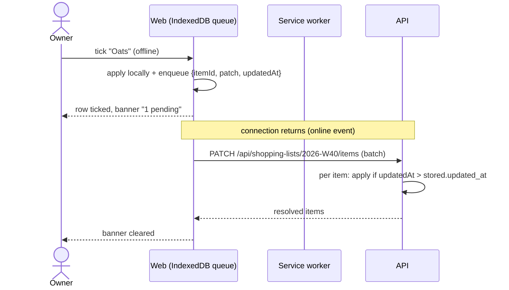

# SPEC-005: Grocery list, costs & offline

| | |
|---|---|
| Status | Draft |
| Sprint | S4 → v0.5.0 |
| PRD refs | S-1 … S-7, NFR offline |
| Design | `design/source/Grocery List.dc.html` (desktop). The mobile list is derived (design-system §10) |

## 1. Summary
Generate the week's shopping list from the meal plan, with quantities merged per ingredient and grouped by category. At the store you tick items off, even offline, and optionally enter what you paid. Estimated cost comes from ingredient prices in EUR. Insights compare estimated and actual spend by week and by category.

## 2. User stories
- **US-1** As the owner, I can generate a list from a week's plan and regenerate it after changing the plan.
- **US-2** As the owner, I can tick items off at the store without a connection, and my ticks sync later.
- **US-3** As the owner, I can add manual items (e.g. "kitchen paper") and change quantities.
- **US-4** As the owner, I can set a price per pack on an ingredient and see estimated costs.
- **US-5** As the owner, I can enter the actual price paid when ticking an item, and see spending insights.

## 3. Acceptance criteria
| ID | Given | When | Then |
|---|---|---|---|
| AC-1 | The W40 plan uses oats in 3 recipes (60 g + 80 g + 40 g) | I generate the W40 list | One "Oats" item of 180 g appears in Grains |
| AC-2 | Units differ (2 eggs + 100 g egg) | Generate | Merged in grams when convertible (`toGrams`); otherwise separate lines |
| AC-3 | Oats priced €1.20 per 500 g | Generate | The estimated cost is €1.20 (one whole pack, rounded up), shown as "~€1.20" |
| AC-4 | No price on an ingredient | Generate | Its cost shows "–"; the total says "estimate excludes 3 items" |
| AC-5 | A generated list with ticks and manual items | The plan changes and I press "Regenerate" | Planned quantities update; ticks, actual prices and manual items are kept; removed ingredients that were ticked are kept and flagged "no longer in plan" |
| AC-6 | Phone offline (airplane mode), list opened earlier | I tick 5 items and add 1 manual item | The UI updates at once; an "Offline · 6 changes pending" banner shows |
| AC-7 | Back online | The app regains a connection | Pending changes sync; the banner disappears; the server state matches |
| AC-8 | The same item edited offline on the phone and online on the laptop | Sync | The most recent `updated_at` wins for that item (last-write-wins) |
| AC-9 | Ticking an item | I enter €3.00 as actual | The item shows €3.00; the actual total updates; the KPI shows actual vs estimate |
| AC-10 | 8 weeks of lists | Open Insights | A weekly spend column chart (actual where known, otherwise the estimate hatched) and a category donut with legend (€ and %) |
| AC-11 | 390 px | Open `/groceries/2026-W40` | Grouped list per category, purchase progress "22 of 40", ≥ 44 px rows, and a sticky "Add item" |

## 4. UI
| Route | Desktop (from design) | Mobile (derived) |
|---|---|---|
| `/groceries/:isoWeek` | KPI row (Estimated cost, Total items, Total kcal) · GroceryTable with category tabs, search, sort, qty stepper, cost, actual, status | Summary card (items, estimated €, progress) · one card per category with CheckRows · add item |
| `/groceries/:isoWeek/insights` | Expense Overview (weekly columns) + Expense Breakdown (donut) + Grocery Category (stacked bar) | Same charts stacked in one column |

**Changes from the design:** EUR instead of $. Expense Overview is weekly, not monthly. The "Filter" button is replaced by category tabs (already in the design). Pagination is replaced by a single scroll (a list is 30–60 items). The "Purchased / Pending" status is driven by the tick. The KPI deltas compare with the previous week and say so. User menu and bell removed.

### Offline sync

### Component inventory
| Level | Component | New? | States |
|---|---|---|---|
| Atom | Tabs (category), Checkbox (meal-check look), MoneyField | new | n/a |
| Molecule | CheckRow (mobile item) | new | pending, purchased, manual, no longer in plan, offline-pending |
| Molecule | GroceryRow (desktop table row) | new | same states + qty stepper |
| Molecule | KpiCard | new | with delta up or down, no previous week |
| Molecule | OfflineBanner | new | offline, n pending, syncing, sync error |
| Organism | GroceryList (mobile), GroceryTable (desktop) | new | empty (no plan), generated, all purchased |
| Organism | ColumnChart, Donut, StackedBar, Legend, ChartTable | new/reuse S3 | dataviz states |
| Page | GroceriesPage, GroceryInsightsPage | new | n/a |

## 5. API
| Method | Path | Request | Response | Errors |
|---|---|---|---|---|
| POST | `/api/shopping-lists/:isoWeek/generate` | `{ mode: "create" \| "regenerate" }` | `ShoppingList` | 404 (no plan), 409 (exists and mode = create) |
| GET | `/api/shopping-lists/:isoWeek` | n/a | `ShoppingList` with items and totals | 404 |
| POST | `/api/shopping-lists/:isoWeek/items` | `{ label, quantity?, unit?, category }` | 201 item | 400 |
| PATCH | `/api/shopping-lists/:isoWeek/items` | `[{ id, patch: { purchased?, actualCostCents?, quantity? }, updatedAt }]` | resolved items | 400 |
| DELETE | `/api/shopping-lists/:isoWeek/items/:id` | n/a | 204 | 404 |
| GET | `/api/spending?weeks=8` | n/a | `{ weeks: [{ isoWeek, estimatedCents, actualCents }], byCategory: [...] }` | n/a |

## 6. Data
The `shopping_list` and `shopping_item` tables and the ingredient price fields are defined in data-model.md. Money is stored in integer cents.

## 7. Business rules (`packages/shared`)
| Function | Rule | Example |
|---|---|---|
| `buildList(plan, recipes)` | Σ over entries (recipe quantity × entry servings ÷ recipe servings), merged by ingredient via `toGrams` when possible | AC-1 |
| `estimateCost(qty, ingredient)` | `ceil(qtyInPackUnit ÷ packQty) × priceCents`; null when there's no price | 180 g at €1.20/500 g → 120 cents |
| `regenerate(old, fresh)` | Keep ticks, actual prices and manual items; update quantities; flag orphans | AC-5 |
| `resolveConflict(stored, incoming)` | last-write-wins on `updated_at` per item | AC-8 |
| `formatEUR(cents, locale)` | locale from PRD Q9 | 5740 → "€57.40" or "57,40 €" |

## 8. Out of scope
Multiple stores, price history per store, barcode scanning, sharing the list, and aisle ordering beyond category.

## 9. Test plan
| Layer | What |
|---|---|
| Unit | `buildList` (merging, conversions, unmergeable units), `estimateCost` (rounding up to packs, missing price), `regenerate`, `resolveConflict`, `formatEUR` |
| Integration | generate/regenerate, the batch PATCH with stale and fresh `updatedAt`, the spending aggregation |
| Component | All components; OfflineBanner states; charts with a table view |
| E2E | AC-1 … AC-11; offline tested with Playwright `context.setOffline(true)` |

## 10. Open questions
- Round estimated cost up to whole packs (proposal), or pro-rate by quantity?
- Should Insights be its own route or a section under the list? Proposal: a section on desktop, a tab on mobile.
