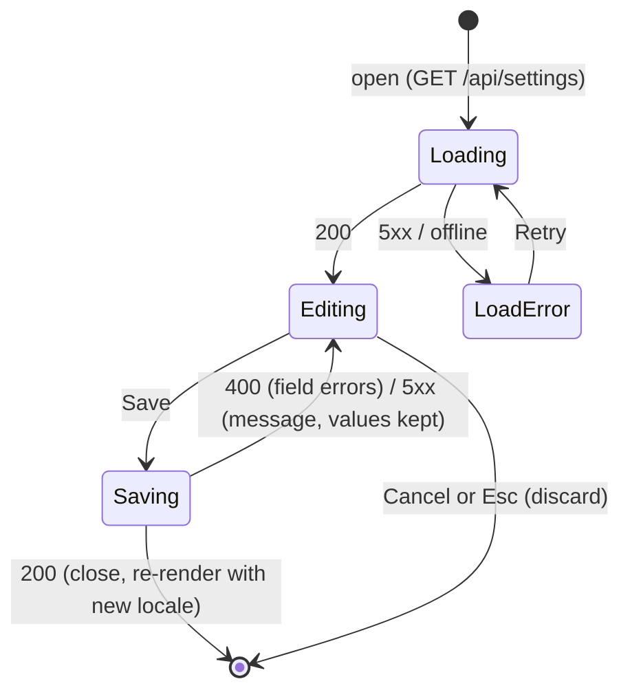
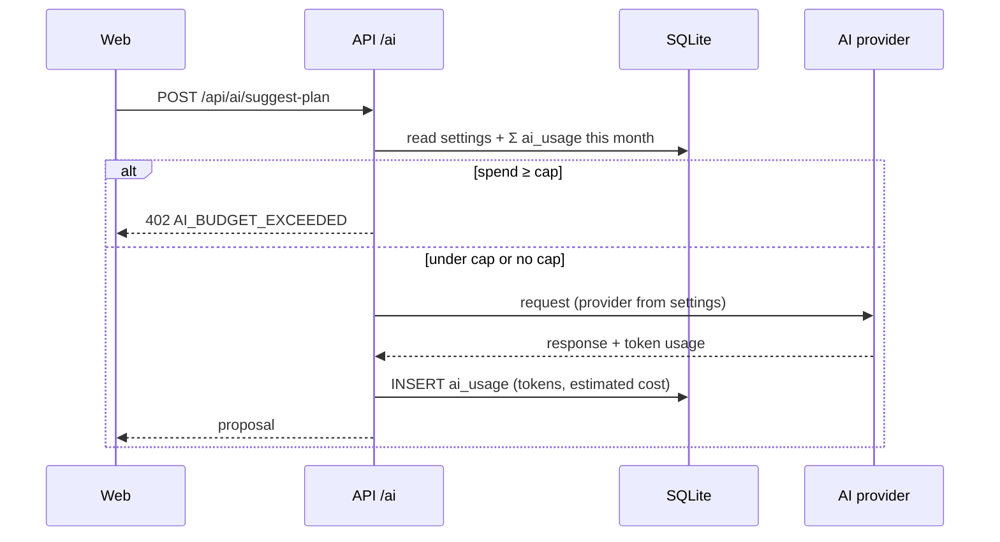

# SPEC-008: Settings

| | |
|---|---|
| Status | Draft |
| Sprint | Staged: S1 locale → S3 nutrition sources → S5 AI provider and spend cap |
| PRD refs | C-1 … C-4, A-4, A-5, §5.7, §5.9 |
| Epic | n/a (created after approval) |
| Design | **Derived**: no settings screen in `design/source/`. It's built from existing atoms and the card and dialog styles |

## 1. Summary
A single configuration modal for app-wide preferences: the number and currency locale, which nutrition sources the import searches, the AI provider, and the monthly AI spend cap. Settings live in the DB (one row), so the laptop and phone always agree. The modal is delivered in sections as the features that need them arrive.

## 2. User stories
- **US-1** As the owner, I can choose how numbers and money are written (`fr-FR` or `en-IE`), so the app reads naturally to me.
- **US-2** As the owner, I can turn each nutrition database (CIQUAL, Open Food Facts) on or off for the ingredient import; results from the ones that are on are merged into one list.
- **US-3** As the owner, I can choose the AI provider, and optionally a model other than its default, knowing where my data goes.
- **US-4** As the owner, I can set a monthly AI budget in euros and see how much of it I've spent this month.

## 3. Acceptance criteria
| ID | Given | When | Then |
|---|---|---|---|
| AC-1 | A fresh DB | I open Settings | Locale `fr-FR` is selected; an amount of 1240 kcal and 5740 cents shows as "1 240 kcal" and "57,40 €" |
| AC-2 | Settings open | I pick `en-IE` and Save | The modal closes; amounts show as "1,240 kcal" and "€57.40"; the choice is still there after a reload and on another device |
| AC-3 | Settings open with a changed value | I press Esc or Cancel | The modal closes and nothing is saved |
| AC-4 | Sources: CIQUAL on, OFF on | I turn OFF off and Save, then search "avoine" in the import sheet | Only CIQUAL is searched; the results show no OFF items |
| AC-5 | Both sources on | I search "avoine" | One list mixes CIQUAL and OFF items, ranked by `mergeCandidates` (§7); each item shows a source badge |
| AC-6 | Both sources off | I open the import sheet | Only "Enter manually" is offered, with a link to Settings |
| AC-7 | Only `ANTHROPIC_API_KEY` is set in env | I open the AI section | Claude is selectable; Mistral and DeepSeek are shown disabled with "No API key configured" |
| AC-7b | Claude selected, model "Default" | I pick another model from the list and Save | AI calls use that model; choosing "Default" again goes back to the provider default (SPEC-006) |
| AC-8 | DeepSeek has a key | I select DeepSeek | A notice "Your prompts (recipes, targets, plans) are sent to servers in China" is shown before I can save |
| AC-9 | Cap €5.00 and €5.02 estimated spend this month | I ask for a plan suggestion | No provider call is made; I see "Monthly AI budget reached (€5.02 of €5.00)" with a link to Settings |
| AC-10 | No cap set | I use AI features | No limit is applied; Settings shows the month's estimated spend without a gauge |
| AC-11 | A 390 px wide screen | I open Settings | It's a full-screen sheet; no horizontal scroll; tap targets ≥ 44 px; focus is trapped inside and returns to the trigger on close |

## 4. UI

### Screens and routes
| Entry point | Screen | Source |
|---|---|---|
| A settings icon button at the right of the mobile top bar, and at the bottom of the desktop sidebar (the tab bar stays at 5 items) | The `SettingsDialog`: a native `<dialog>` (modal on desktop, a full-screen sheet < 768 px). Sections: **Display** (locale), **Nutrition sources**, **AI** (provider, model, monthly cap, this month's spend) | **Derived** |

A section appears only once its feature exists (S1: Display; S3: + Nutrition sources; S5: + AI). Save sends the whole object; Cancel discards.

### Component inventory (bottom-up)
| Level | Component | New / existing | States |
|---|---|---|---|
| Atom | Button, Icon, Select, NumberField (€ suffix) | S0 / SPEC-002 | as specified there |
| Atom | IconButton (settings) | new | default, hover, focus, active (dialog open) |
| Atom | Switch | new | on, off, focus, disabled |
| Molecule | SettingRow (label, help text, control) | new | with/without help, error |
| Molecule | SourceSwitches (one Switch per source, with its credit line) | new | both on, one off, both off (with "manual only" hint) |
| Molecule | ProviderOption (radio + model select, "Default" first + notice) | new | selected, available, no API key (disabled), model overridden, with privacy notice |
| Molecule | SpendMeter (spent vs cap, EUR) | new | no cap, 0 %, typical, reached / over |
| Organism | SettingsDialog | new | S1 sections only, all sections, dirty, saving, save error, loading |
| Page | n/a (it's a dialog mounted in the app shell) | n/a | n/a |

### Flow

## 5. API
| Method | Path | Request (Zod) | Response | Errors |
|---|---|---|---|---|
| GET | `/api/settings` | n/a | `Settings` + `providers: [{ id, available, models }]` + `aiSpendThisMonthMicroEur` | n/a |
| PUT | `/api/settings` | `SettingsInput` | `Settings` | 400 (unknown locale or source, unavailable provider, negative cap) |

Any AI route (SPEC-006) returns `402 AI_BUDGET_EXCEEDED` with `{ spentMicroEur, capCents }` when the cap is reached.

## 6. Data
New tables (also in `data-model.md`):
- `settings`: one row, `CHECK (id = 1)`, created by the migration with the defaults `locale = 'fr-FR'`, `source_ciqual = 1`, `source_off = 1` (integer booleans), `ai_provider = 'anthropic'`, `ai_model = NULL` (the provider's default), `ai_monthly_cap_cents = NULL` (no cap).
- `ai_usage`: `id`, `at` (ISO), `provider`, `model`, `input_tokens`, `output_tokens`, `cost_micro_eur` (an integer estimate frozen at call time).

The `source_*` and `ai_*` columns are added by the S1 migration too, so there's only one `settings` migration. They're unused until S3 and S5.

## 7. Business rules (`packages/shared`)
| Function | Rule | Example |
|---|---|---|
| `formatNumber(n, locale)` | `Intl.NumberFormat(locale, { maximumFractionDigits: 0 })` | 1240 → "1 240" (fr-FR, U+202F thin no-break space) / "1,240" (en-IE) |
| `formatEUR(cents, locale)` | `Intl.NumberFormat(locale, { style: 'currency', currency: 'EUR' })` on cents ÷ 100 (SPEC-005) | 5740 → "57,40 €" / "€57.40" |
| `activeSources(settings)` | the sources whose switch is on; none means manual only | `source_off = 0` → `["ciqual"]` |
| `mergeCandidates(lists, q)` | one list, ranked by name match: exact (case- and accent-insensitive) > starts with `q` > contains `q` > other; ties: CIQUAL before OFF, then alphabetical | q "avoine": CIQUAL "Avoine, flocons" and OFF "Flocons d'avoine" → CIQUAL item first |
| `estimateCostMicroEur(usage, prices)` | (input × inPrice + output × outPrice) per million tokens, from the price table in `shared`; an unknown model throws | 1 000 in + 500 out at 3/15 € per M → 10 500 micro-€ |
| `monthSpend(rows, now)` | Σ `cost_micro_eur` for the current calendar month (local time) | rows on Sep 30 and Oct 1 → only October counts on Oct 2 |
| `canCallAi(spendMicroEur, capCents)` | true when there's no cap or spend < cap × 10 000 | 5 020 000 vs 500 → false |

## 8. Out of scope
Storing API keys in the app (they stay in env, ADR-0010); a dark theme (SPEC-001); other currencies (EUR only, PRD §5.9); per-device settings; editing the price table from the UI; the targets form (stays on `/targets`, SPEC-004).

## 9. Test plan
| Layer | What |
|---|---|
| Unit | `formatNumber` and `formatEUR` for both locales (assert the exact U+202F / U+00A0 characters), `activeSources`, `mergeCandidates` (each rank, ties, accents), `estimateCostMicroEur`, `monthSpend` across a month boundary with a fixed clock, `canCallAi` at, below and above the cap |
| Integration | GET/PUT `/api/settings` (defaults on a fresh DB, validation errors, unavailable provider rejected), 402 from an AI route with a seeded `ai_usage`, provider availability driven by env |
| Component | Every component above in every state, with axe; SettingsDialog focus trap and Esc |
| E2E | AC-1 … AC-11 (AC-4…AC-6 from S3, AC-7…AC-10 from S5), mobile and desktop viewports |

## 10. Open questions
All resolved 2026-09-23:
- ~~Q-A Entry point~~: a settings icon in the mobile top bar and at the bottom of the desktop sidebar.
- ~~Q-B Locale parameters~~: **one** setting (`fr-FR` / `en-IE`) that drives both numbers and money.
- ~~Q-C Staging~~: S1 Display → S3 Nutrition sources → S5 AI.
- ~~Q-D Source settings~~: **merged results**, ranked together (`mergeCandidates`); only the on/off switches remain, with no source order.
- ~~Q-E Model choice~~: a default model per provider (set in SPEC-006), with an optional override.
- ~~Q-F Sub-cent costs~~: `ai_usage` stores **micro-euros**, frozen at call time.
