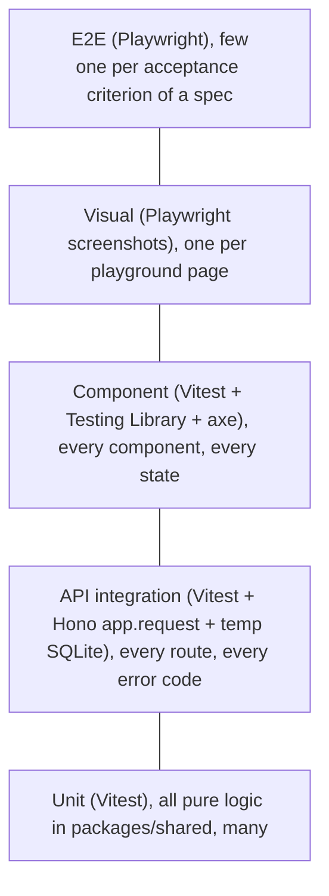

# Testing strategy

Every piece of code has tests, written first (coding policy §3). CI blocks a merge on any failure.

## 1. The pyramid

## 2. What, where, how

| Layer | Location | Tool | Runs in CI job |
|---|---|---|---|
| Unit | `packages/shared/**/*.test.ts` | Vitest | `test` |
| API integration | `apps/api/**/*.test.ts` | Vitest, a fresh SQLite file per test file, migrations applied | `test` |
| Component | `apps/web/src/**/*.test.tsx` | Vitest (jsdom), Testing Library, `axe-core` via `src/axe.ts` (all rules except `color-contrast`, ADR-0008) | `test` |
| Visual | `apps/web/e2e/playground.spec.ts` | Playwright screenshots of `/playground/*` at 390 px and 1280 px | `e2e` |
| E2E | `apps/web/e2e/*.spec.ts` | Playwright against the built app (`vite preview` until the Docker image exists, #18), axe injected from `axe-core` | `e2e` |
| Performance/PWA | n/a | Lighthouse CI | `lighthouse` (from S1) |
| Migrations | `apps/api/db/migrations.test.ts` | Apply all migrations to an empty DB and to the previous release's fixture | `test` |

External services (OFF, USDA, Claude) are **always mocked** in CI with recorded fixtures. A separate weekly `contract` workflow can call the real APIs later if needed.

## 3. Coverage gates

| Package | Lines | Branches |
|---|---|---|
| `packages/shared` | 95 % | 90 % |
| `apps/api` | 85 % | 80 % |
| `apps/web` (components) | 80 % | 75 % |

Coverage may not decrease in a PR. Excluded from coverage: `*.playground.tsx`, generated migrations, and the boot files `main.tsx` (web) and `index.ts` (api). The gates are enforced per package in `vitest.config.js`.

## 4. Test conventions

- Name tests after behaviour: `it("rejects servings of 0 with VALIDATION_FAILED")`.
- Use Arrange / Act / Assert, one behaviour per test, and build data with small factory helpers. Avoid huge fixtures.
- Query the DOM by role or label (Testing Library priorities). Never by CSS class.
- Tests are deterministic: use a fixed clock (`vi.setSystemTime`) for week logic and no real network.
- `.only` and `.skip` fail CI (a lint rule).
- A bug fix always adds a regression test named after the issue: `it("#31 …")`.

## 5. Spec → test traceability

Every acceptance criterion in a spec has an ID (`SPEC-003/AC-2`). The matching e2e test contains that ID in its title, so `grep` shows which criteria are covered.
